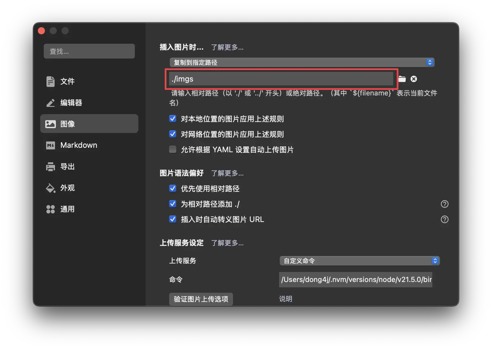
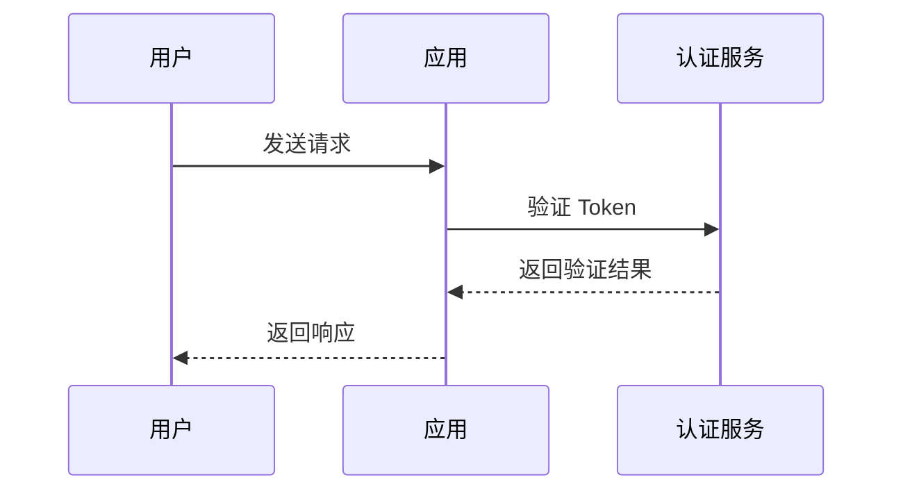

# 关于这个项目

## 📖 背景

作为一名 Java 开发者，我意识到在微服务架构日益普及的今天，开发者需要一套完整、规范且开箱即用的工程体系。**Zeka Stack** 就是为此而生的现代化 Java
微服务工程体系，它基于 **Spring Boot** 和 **Spring Cloud** 构建，整合了业界最佳实践，帮助开发团队快速搭建高质量的企业级应用。

因此，我创建这个项目的初衷很简单：提供一套经过实践检验的微服务开发框架，将常用的基础组件、开发规范和最佳实践整合在一起，让开发者能够专注于业务逻辑的实现，而不必重复造轮子。

### 目标

- 🎯 **开箱即用**：提供完善的基础组件和 Starter，快速启动项目
- 💡 **模块化设计**：高度解耦的模块化架构，按需引入，灵活组合
- 🚀 **规范化开发**：融合业界最佳实践，提供统一的开发规范
- 📚 **文档完善**：每个模块都包含完整的文档和使用示例

### 技术栈

- **Spring Boot**: 3.x
- **Spring Cloud**: 2023.x
- **Java**: 17+
- **文档构建**: VitePress 1.6.3

## 🤝 如何贡献

我们欢迎所有形式的贡献！无论是修复 bug、添加新功能、改进文档还是优化代码，都非常感谢。

### 贡献流程

1. **Fork 项目**：点击右上角的 Fork 按钮，将项目 Fork 到你的 GitHub 账号

2. **克隆仓库**：
   ```bash [bash]
   git clone https://github.com/YOUR_USERNAME/zeka-stack.git
   cd zeka-stack
   ```

3. **创建分支**：
   ```bash [bash]
   git checkout -b feature/your-feature-name
   # 或
   git checkout -b fix/your-bug-fix
   ```

4. **进行修改**：按照代码规范和文档规范进行开发

5. **提交代码**：
   ```bash [bash]
   git add .
   git commit -m "feat: 添加新功能描述"
   git push origin feature/your-feature-name
   ```

6. **创建 Pull Request**：在 GitHub 上创建 Pull Request，详细描述你的修改内容

### 提交信息规范

我们使用 [Conventional Commits](https://www.conventionalcommits.org/) 规范：

- `feat`: 新功能
- `fix`: 修复 bug
- `docs`: 文档更新
- `style`: 代码格式调整（不影响代码逻辑）
- `refactor`: 代码重构
- `test`: 测试相关
- `chore`: 构建工具或辅助工具的变动

示例：

```bash [bash]
feat: 添加日志系统 Starter
fix: 修复认证模块的空指针异常
docs: 更新快速开始文档
```

## 📐 代码规范

### Java 代码规范

本项目遵循 **Google Java Style Guide**，并配置了 Checkstyle 和 Google Java Format 进行代码检查。

#### 基本规范

- **缩进**：使用 4 个空格，不使用 Tab
- **行长度**：最大 120 个字符
- **编码**：UTF-8
- **换行符**：Unix 风格（LF）

#### 编辑器配置

项目已配置 `.editorconfig`，支持该规范的编辑器会自动应用格式：

```ini
[*]
charset = utf-8
end_of_line = lf
insert_final_newline = true
trim_trailing_whitespace = true

[*.java]
indent_style = space
indent_size = 4
max_line_length = 120
```

#### 代码格式化

使用 Google Java Format (AOSP 风格)：

```bash [bash]
# 格式化单个文件
mvn com.spotify.fmt:fmt-maven-plugin:format -pl <module-name>

# 格式化所有模块
mvn com.spotify.fmt:fmt-maven-plugin:format
```

#### Checkstyle 检查

```bash [bash]
# 检查单个模块
mvn checkstyle:check -pl <module-name>

# 检查所有模块
mvn checkstyle:check
```

### 代码风格要求

1. **类命名**：使用 PascalCase，如 `AuthService`
2. **方法命名**：使用 camelCase，如 `getUserInfo()`
3. **常量命名**：使用 UPPER_SNAKE_CASE，如 `MAX_RETRY_COUNT`
4. **包命名**：使用小写字母，多个单词用点分隔，如 `dev.zeka.stack.auth`
5. **注释**：所有公共类和方法必须添加 JavaDoc 注释

## 📝 文档规范

### 文档结构

每个模块的文档应包含以下部分：

1. **一级标题**：清晰描述模块功能
2. **简介**：模块的作用和适用场景
3. **快速开始**：如何快速使用该模块
4. **详细说明**：核心概念和使用方法
5. **相关链接**：相关的官方文档或其他模块
6. 其他觉得有必要添加的内容

**一级标题** 将作为文档主页的菜单, (不要超过 20 个字符).

文档在部署时会自动添加 **代码示例**, **贡献者 **和 **页面历史** 3 个二级章节内容.

所以只需要专注教程内容编写, 其他的全部由脚本自动完成.

---

### Markdown 规范

- **代码块**：使用语法高亮，如 ` ```java` 或 ` ```bash`
- **链接**：使用 **双向链接** 链接到其他文档
- **图片**：
    - 使用相对路径，存储在模块的 `imgs/` 目录下
    - 图片路径示例：``

> 推荐使用 Typora 编辑, 可以设置图片保存路径:
>
> 
>

---

### VitePress 特殊语法

基于 VitePress 构建，支持丰富的 Markdown 扩展语法，可以让文档更加生动和易读。

#### 代码图标

在代码块中添加文件图标，使用文件名作为标签即可自动显示对应的图标：

**Markdown 源代码**：

````markdown
```java [java]
public static void main(String[] args) {}
```
````

**渲染效果**：

```java [java]
public static void main(String[] args) {}
```

#### 代码组（Code Group）

展示多种安装或使用方式的代码块组合：

**Markdown 源代码**：

````markdown
::: code-group

```xml [Maven]
<dependency>
    <groupId>dev.zeka.stack</groupId>
    <artifactId>cubo-logsystem-spring-boot-starter</artifactId>
</dependency>
```

```groovy [Gradle]
implementation 'dev.zeka.stack:cubo-logsystem-spring-boot-starter'
```

:::
````

**渲染效果**：

::: code-group

```xml [Maven]
<dependency>
    <groupId>dev.zeka.stack</groupId>
    <artifactId>cubo-logsystem-spring-boot-starter</artifactId>
</dependency>
```

```groovy [Gradle]
implementation 'dev.zeka.stack:cubo-logsystem-spring-boot-starter'
```

:::

#### 时间线（Timeline）

展示事件或步骤的时间线：

**Markdown 源代码**：

````markdown
::: timeline 2025-12-01

- **Zeka Stack 首次发布**
- 支持日志系统
- 支持认证授权

:::

::: timeline 2025-11-01

- Zeka Stack 项目启动
- 社区反馈收集

:::
````

**渲染效果**：

::: timeline 2025-12-01

- **Zeka Stack 首次发布**
- 支持日志系统
- 支持认证授权

:::

::: timeline 2025-11-01

- Zeka Stack 项目启动
- 社区反馈收集

:::

#### 思维导图（Markmap）

使用 Markmap 创建可交互的思维导图：

**Markdown 源代码**：

````markdown
```markmap
# Zeka Stack
## Arco Meta
- 元数据管理
## Blen Kernel
- 认证授权
- 日志系统
## Cubo Starter
- 快速启动器
```
````

**渲染效果**：

```markmap
# Zeka Stack
## Arco Meta
- 元数据管理
## Blen Kernel
- 认证授权
- 日志系统
## Cubo Starter
- 快速启动器
```

#### 流程图（Mermaid）

使用 Mermaid 创建流程图、时序图、甘特图等：

**Markdown 源代码**：

````markdown

````

**渲染效果**：


#### Badge 组件

使用 Badge 组件标注版本、状态等信息：

**Markdown 源代码**：

```markdown
- Zeka Stack <Badge type="info" text="1.0.0" />
- Spring Boot <Badge type="tip" text="3.x" />
- Java <Badge type="warning" text="17+" />
- 实验性功能 <Badge type="danger" text="beta" />
```

**渲染效果**：

- Zeka Stack <Badge type="info" text="1.0.0" />
- Spring Boot <Badge type="tip" text="3.x" />
- Java <Badge type="warning" text="17+" />
- 实验性功能 <Badge type="danger" text="beta" />

#### 聚焦代码

高亮代码中的特定行，便于讲解：

**Markdown 源代码**：

````markdown
```java{4,8-10}
@RestController
public class UserController {

    private final UserService userService;  // [!code focus]

    @GetMapping("/user")
    public User getUser(@RequestParam Long id) {  // [!code focus]
        return userService.findById(id);  // [!code focus]
    }
}
```
````

**渲染效果**：

```java{4,8-10}
@RestController
public class UserController {

    private final UserService userService;  // [!code focus]

    @GetMapping("/user")
    public User getUser(@RequestParam Long id) {  // [!code focus]
        return userService.findById(id);  // [!code focus]
    }
}
```

#### GitHub 风格警报

使用 GitHub 风格的警报框突出重要信息：

**Markdown 源代码**：

```markdown
> [!提醒] 重要
> 强调用户在快速浏览文档时也不应忽略的重要信息。

> [!建议]
> 有助于用户更顺利达成目标的建议性信息。

> [!重要]
> 对用户达成目标至关重要的信息。

> [!警告]
> 因为可能存在风险，所以需要用户立即关注的关键内容。

> [!注意]
> 行为可能带来的负面影响。
```

**渲染效果**：

> [!提醒] 重要
> 强调用户在快速浏览文档时也不应忽略的重要信息。

> [!建议]
> 有助于用户更顺利达成目标的建议性信息。

> [!重要]
> 对用户达成目标至关重要的信息。

> [!警告]
> 因为可能存在风险，所以需要用户立即关注的关键内容。

> [!注意]
> 行为可能带来的负面影响。

#### 技术栈徽章

使用 Shields.io 展示技术栈徽章：

**Markdown 源代码**：

````markdown
<p>
  
  
  
</p>
````

**渲染效果**：

<p>
  
  
  
</p>

## ✍️ 编写文档

### 在哪里编写文档

**模块目录**（如 `arco-meta`、`blen-kernel`、`cubo-starter`）：

- 每个代码模块下都 **必须** 有一个 **README.md** 文件, 这个 README.md 文件就是对应章节的文档, 在执行 GitHub Action 时会通过脚本完成自动部署.

- 图片放在 `imgs/` 目录下（支持 PNG、JPG 等格式，部署时会自动转换为 WebP）
- 若希望在不影响主文档叙事节奏的前提下补充更深入的案例、FAQ 或实验笔记，可在模块根目录新增 `docs/` 目录，并创建一个或多个 `.md` 文件。

**非模块目录**（如 `guide`、`about`）：

- 直接在 `docs/` 目录下编写文档

- 图片放在对应的 `imgs/` 目录下

---

## 📦 文档部署

### GitHub Actions

**触发条件**（需要同时满足）：

1. 推送到 `main` 或 `master` 分支
2. 变更的文件是任意位置的 `.md` 文件（包括 `README.md`、`docs/*.md` 等所有 Markdown 文件）
3. 提交信息中包含 `@dd` 关键词

**使用示例**：

```bash [bash]
# 修改文档后提交（可以是任意 .md 文件）
git add arco-meta/README.md
git commit -m "更新模块文档 @dd"
git push origin main

# 或者修改其他 Markdown 文件
git add about/index.md
git commit -m "更新关于页面 @dd"
git push origin main
```

> [!重要] 触发条件
> 只有**同时满足**以上三个条件，GitHub Actions 才会自动部署。其他情况需要在 GitHub 手动触发。

### 手动部署

**方式一：GitHub Actions 手动触发**

1. 访问项目的 GitHub 仓库：`https://github.com/zeka-stack/zeka-stack.github.io`
2. 点击 **Actions** 标签页
3. 选择 **Deploy Docs** workflow
4. 点击 **Run workflow** 按钮
5. 选择分支并执行

---

### 本地预览

执行以下命令进行文档构建：

```bash [bash]
# 在 docs 目录下执行
cd docs

# 1. 图片转换和文档同步（自动将图片转换为 WebP 并同步文档）
bash deploy.sh

# 2. 构建文档站点
npm run build

# 3. 预览构建结果（可选）
npm run preview
```

> [!注意] 文档位置
>
> - **不要直接在 `docs/` 目录下编辑模块文档**，这些文档会从源码目录自动同步，修改会被覆盖
> - 非模块目录（如 `guide`、`about`）可以直接在 `docs/` 目录下编辑

## 📚 相关资源

### 项目链接

- **GitHub 仓库**：https://github.com/zeka-stack
- **文档站点**：https://zeka-stack.dong4j.site
- **Issues**：https://github.com/zeka-stack/zeka-stack.github.io/issues

### 官方文档

- **Spring Boot 官方文档**：https://spring.io/projects/spring-boot
- **Spring Cloud 官方文档**：https://spring.io/projects/spring-cloud

## 👥 团队成员

感谢以下团队成员对 Zeka Stack 项目的贡献和支持！

<script setup>
import { VPTeamMembers } from 'vitepress/theme'

const members = [
  {
    avatar: 'https://www.github.com/dong4j.png',
    name: 'dong4j',
    title: 'Creator',
    org: 'Zeka.Stack',
    orgLink: 'https://github.com/zeka-stack',
    desc: '司机带你开车',
    links: [
      { icon: 'github', link: 'https://github.com/dong4j' },
      { icon: 'twitter', link: 'https://twitter.com/dong4j' }
    ]
  },
  {
    avatar: 'https://www.github.com/ogromwang.png',
    name: 'ogromwang',
    title: 'Developer',
    org: 'Zeka.Stack',
    orgLink: 'https://github.com/zeka-stack',
    desc: '',
    links: [
      { icon: 'github', link: 'https://github.com/ogromwang' }
    ]
  },
  {
    avatar: 'https://www.github.com/hyqf98.png',
    name: 'hyqf98',
    title: 'Developer',
    org: 'Zeka.Stack',
    orgLink: 'https://github.com/zeka-stack',
    desc: '',
    links: [
      { icon: 'github', link: 'https://github.com/hyqf98' }
    ]
  }
]
</script>

<VPTeamMembers size="small" :members="members" />

## 💬 联系我们

如有问题或建议，欢迎：

- 📧 提交 Issue：https://github.com/zeka-stack/zeka-stack.github.io/issues
- 💬 发起讨论：https://github.com/zeka-stack/zeka-stack.github.io/discussions
- 🐛 报告 Bug：请使用 Issue 模板

---

感谢你对 Zeka Stack 项目的关注和支持！🎉
