## ✨ 前言

虽然 Zeka.Stack 是全开源的, 但是每个组件也可以单独使用, 为了避免需要克隆所有项目然后本地 install 才能使用, 所以最简单的方式就是将 Zeka.Stack
的组件上传到 Maven 公共仓库, 所有就有这篇水文.

为什么说是水文呢, 因为这类的文章网上也有很多了, 这里再写一遍其实没有啥价值, 不过为了完善我 Zeka.Stack 的知识体系, 所以还是决定写一写.

---

## 🧰 准备工作

这里演示使用自己的域名来作为 `groupId`, 所以需要 DNS 验证, 其他方式比如 GItHub, GitLab 等验证相对来说更容易些.

个人觉得 GitHub 作为 `groupId` 太长了, 比如我如果使用 GitHub 验证的话 `groupId` 就是 `io.github.dong4j`, 而且为了打造自己的 IP,
所以选择使用一个二级域名, 正好前段时间在 Cloudflare 注册了 `dong4j.dev` 的域名, 这里就可以用上了.

如果要图方便的话, 可以直接使用 [arco-supreme](https://github.com/zeka-stack/arco-supreme) 这个项目来做测试.

## 📝 注册 Sonatype 账户

自 2024 年 3 月 12 日起，所有注册将通过中央门户网站进行。有关旧注册的信息，请参阅 [相关文档](https://central.sonatype.org/register/legacy/)。

这里第一步就是先无脑注册一个账号, [这里是注册地址](https://central.sonatype.com/):

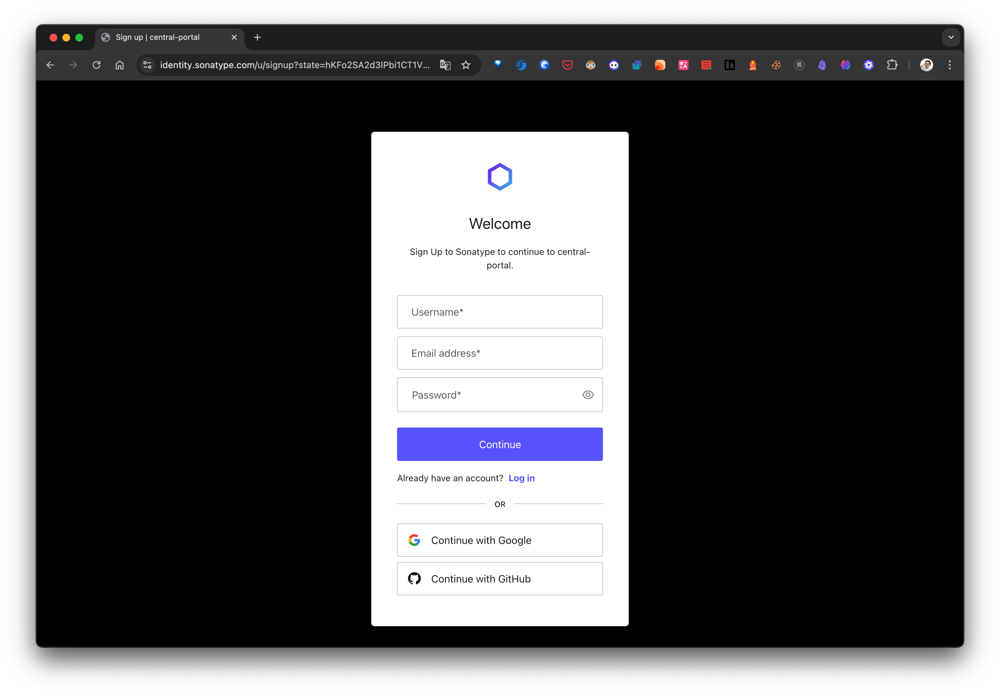

我这里直接选择通过 Google 账号进行注册.

然后就是添加 `Namespace` 了:

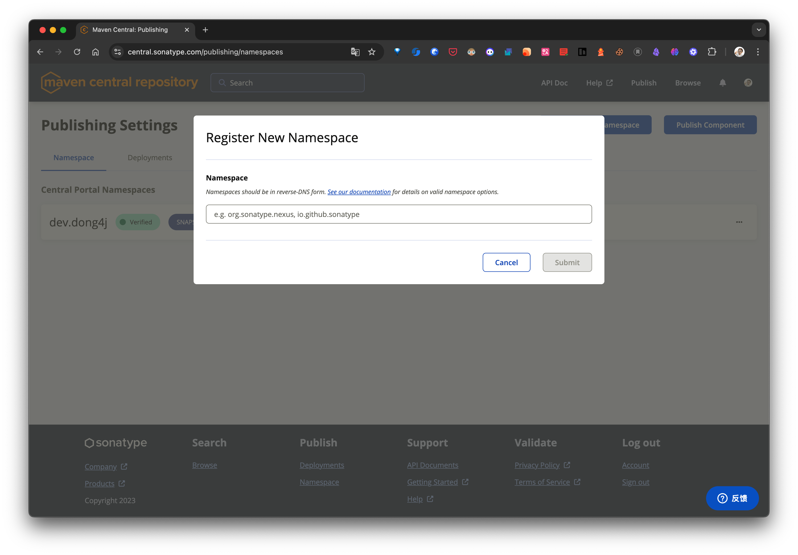

在发布组件之前，必须选择一个命名空间。在 Maven 生态系统中，这也称为 groupId，它是描述发布到 Maven Central 的任何组件的三个必需坐标之一，即
groupId、artifactId 和 version。

创建一个命名空间后, 需要验证才能使用. 因为我使用的是自定义域名, 所以这里只能添加一个 DNS TXT 记录的方式来验证命名空间:

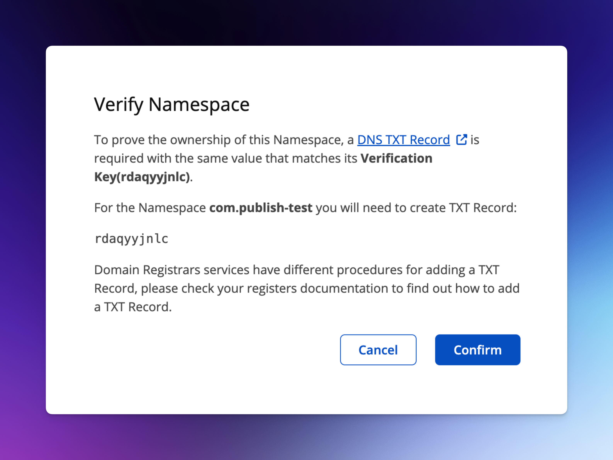

DNS TXT 记录添加几分钟后即可认证成功:  
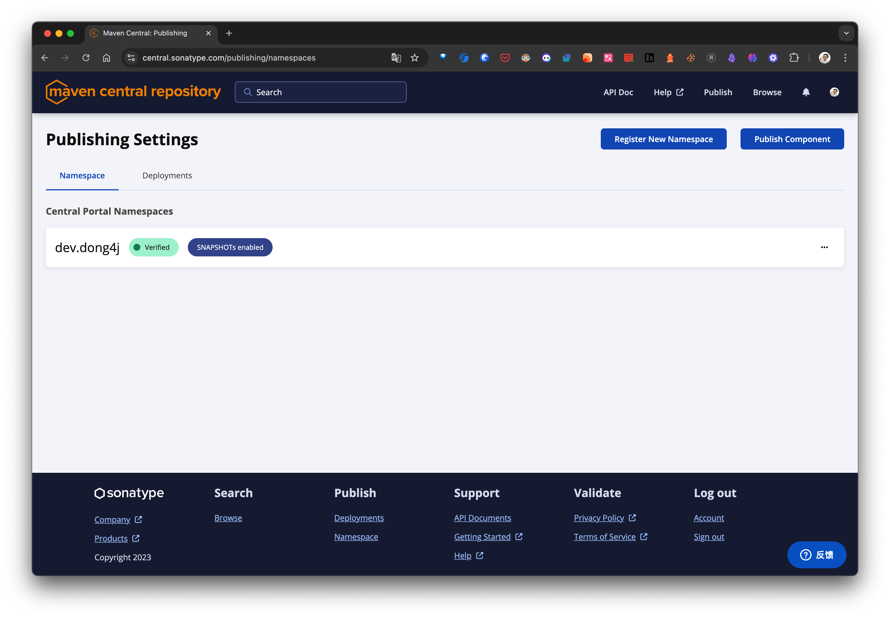

账号的申请后验证都通过之后, 接下来才是重头戏, 其实也没那么复杂, 按照教程一步步来即可.

## 🔐 生成令牌

必须使用用户令牌才能将工件发布到中央存储库。

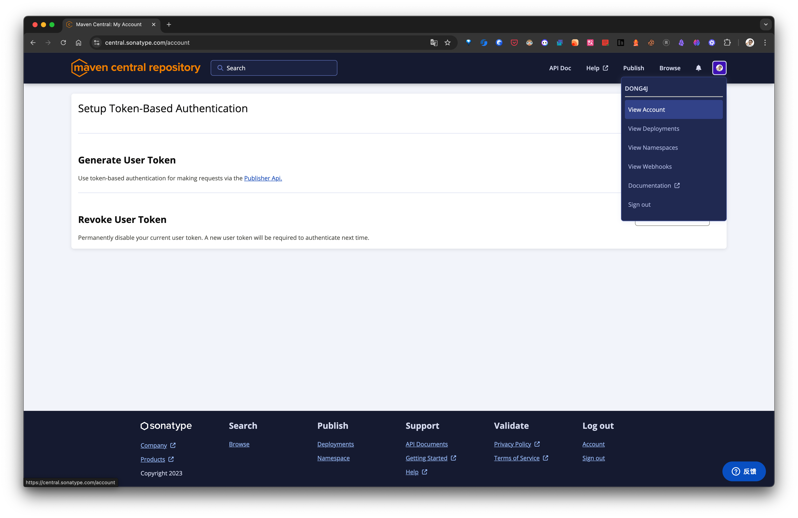

点击 `Generate User Token` 直接生成一个 `server` 配置, 这个是需要配置到 `settings.xml` 中的, 生成的 `Token` 可以直接拷贝, 比如:

```xml
<server>
	<id>${server}</id>
	<username>xxxxxxx</username>
	<password>xxxxxxxxxxxxxxxxxxxxxxxxxxx</password>
</server>
```

然后自行配置到 `settings.xml` 文件中, 这里给出一个默认配置:

```xml
<?xml version="1.0" encoding="UTF-8"?>
<settings xmlns="http://maven.apache.org/SETTINGS/1.0.0"
          xmlns:xsi="http://www.w3.org/2001/XMLSchema-instance"
          xsi:schemaLocation="http://maven.apache.org/SETTINGS/1.0.0 http://maven.apache.org/xsd/settings-1.0.0.xsd">

    <servers>
        <!-- 公共仓库 -->
        <server>
            <id>central</id>
            <username>xxxxxxx</username>
            <password>xxxxxxxxxxxxxxxxxxxxxxxxxxx</password>
        </server>
    </servers>

</settings>
```

上面的 id 需要跟 pom.xml 的配置对应起来, 后面会有说明.

---

**需要注意的是这个 `Token` 只能生成一个, 重新生成的时候会将原来的 `Token` 清除:**

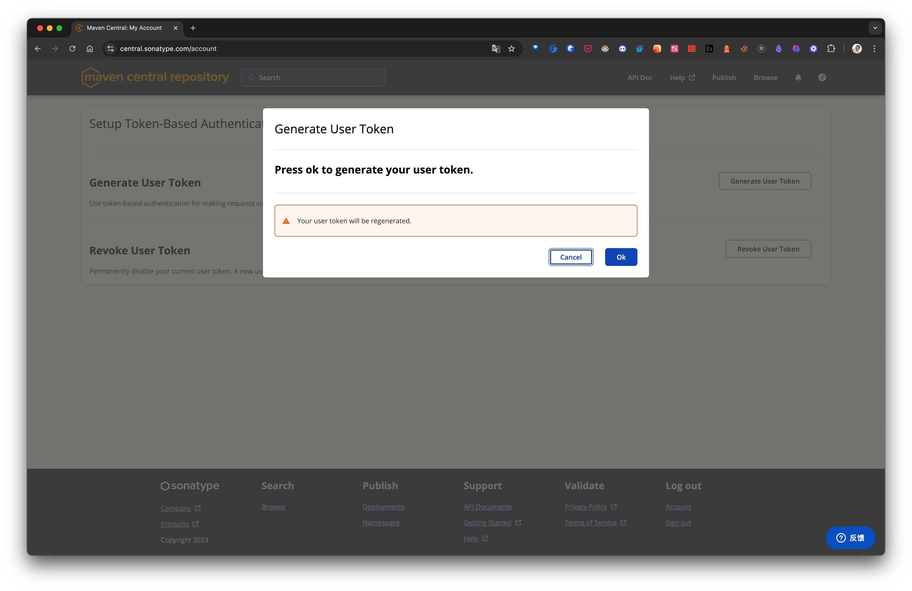

---

## 🔏 配置 GPG 签名

GPG 签名允许使用者验证构件的发布者身份。通过签名，开发者可以证明构件确实是由其本人发布的，防止他人冒充发布者上传恶意构件。Maven
中央仓库明确要求所有上传的构件必须进行 GPG 签名，并提供相应的 .asc 签名文件。

所以我们还要准备 GPG 签名工具, 在 macOS 上, 我使用 [GPGTools](https://gpgtools.org/):

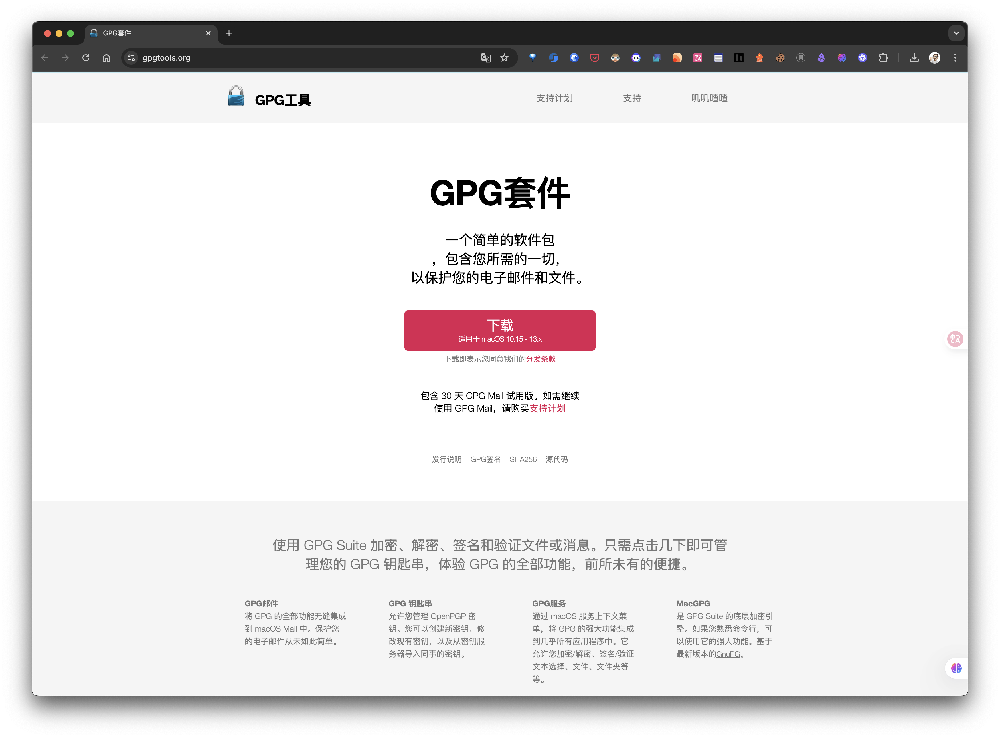

我安装的版本信息:


第一步当然是新建一个 key, 一定要记住 **密码**. 密钥过期时间是可以自定义的, 这个根据实际情况自行修改.

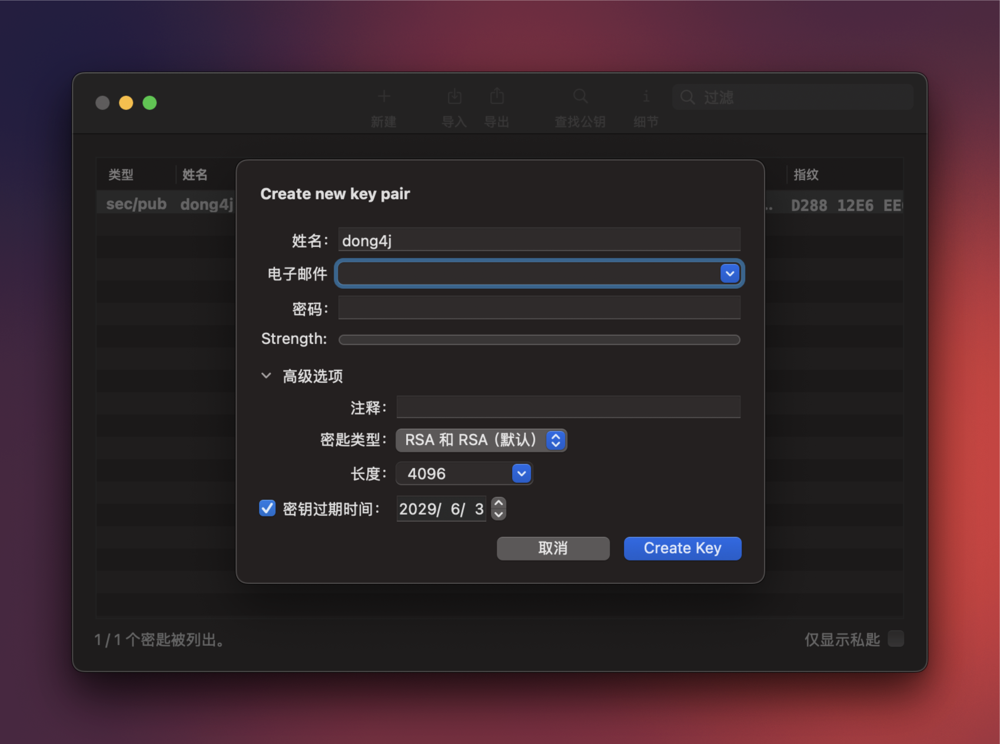

最后是将公钥上传到服务器, 服务器地址可在设置中配置, 默认的是: [hkps://keys.openpgp.org](hkps://keys.openpgp.org)

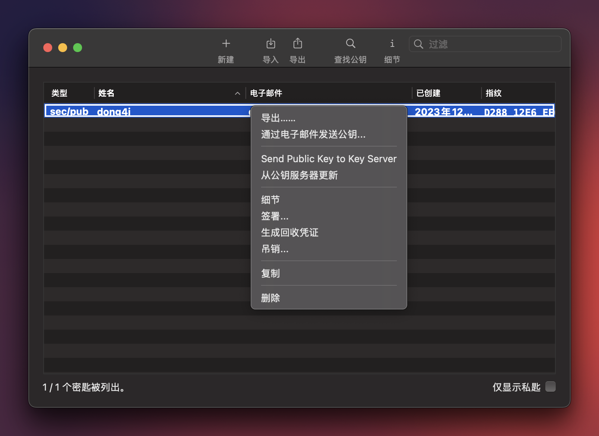

> 如果 windows 系统，可以下载<https://www.gpg4win.org/> ，使用方式差不多

---

### 🧙‍♂️ 命令行创建密钥对

当然也可以使用命令行创建密钥对，我的版本是: `gpg (GnuPG/MacGPG2) 2.2.41`

```bash
# 创建密钥对，按提示输入用户名称和邮箱地址
gpg --generate-key

# 列出密钥，username 就是创建密钥对是的用户名，此处也可以使用邮箱
# 结果中第二行一长串的后8位就是 keyId，比如：30FF8D58，gradle 构建时会用到
gpg --list-keys username

# 也可以直接通过id查询
gpg --list-keys 30FF8D58

# 上传公钥到 server key，默认上传到 hkps://keys.openpgp.org，但是提示上传失败
# 看到网上的示例可以通过 --keyserver 指定上传的服务器地址，但是我这个版本[gpg (GnuPG/MacGPG2) 2.2.41]没有这个参数
# 使用 https://gpgtools.org 上传公钥就会成功
gpg --send-keys 30FF8D58

# 查看指纹
gpg --fingerprint 30FF8D58

# 删除私钥，这里也可以使用用户名称或者邮箱，如果唯一的话
gpg --delete-secret-keys 30FF8D58

# 删除公钥
gpg --delete-keys 30FF8D58
```

---

## ⚙️ pom.xml 配置

### 🧩 groupId 配置

```xml
<groupId>dev.dong4j</groupId>
<artifactId>arco-supreme</artifactId>
<version>0.0.1</version>
<packaging>pom</packaging>
```

这里的 `groupId` 就是前面说的命名空间, 必须认证通过才能正常上传, 比如我修改成 `dev11.dong4j` 就会报错:

```
...
[INFO] Uploaded bundle successfully, deployment name: Deployment, deploymentId: 804b4d10-1a4f-41af-b7db-43dfc12056e0. Deployment will publish automatically
[INFO] Waiting until Deployment 804b4d10-1a4f-41af-b7db-43dfc12056e0 is validated
[ERROR] 

Deployment 804b4d10-1a4f-41af-b7db-43dfc12056e0 failed
pkg:maven/dev11.dong4j/arco-supreme@0.0.1?type=pom:
 - Namespace 'dev11.dong4j' is not allowed

[INFO] ------------------------------------------------------------------------
[INFO] BUILD FAILURE
[INFO] ------------------------------------------------------------------------
[INFO] Total time:  25.427 s (Wall Clock)
[INFO] Finished at: 2025-06-03T20:01:39+08:00
...
```

在控制台也有相关的错误信息:

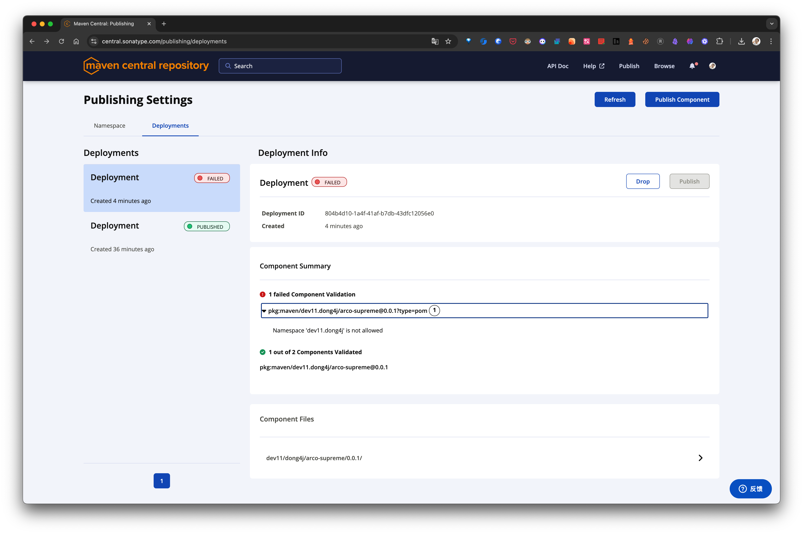

### 🧵 central-publishing-maven-plugin

这里重点介绍 central-publishing-maven-plugin 插件。该插件用于将 JAR 包发布到 Maven Central 仓库。如果未将参数 autoPublish 设置为
true，则上传后的包会处于 VALIDATED 状态。此时需要登录 [https://central.sonatype.com](https://central.sonatype.com/)，进入 Deployment
页面，找到刚刚上传的包，在右侧点击 Publish 按钮。

如果一切正常，约 10 分钟后状态将变为 PUBLISHED，表示发布成功；若状态变为 FAILED，可在 Component Summary 中查看失败原因，修复后重新发布即可。

而 `autoPublish=true` 即可省去手动验证的步骤.

```xml
<plugin>
    <groupId>org.sonatype.central</groupId>
    <artifactId>central-publishing-maven-plugin</artifactId>
    <version>0.7.0</version>
    <extensions>true</extensions>
    <configuration>
        <publishingServerId>central</publishingServerId>
        <autoPublish>true</autoPublish>
    </configuration>
</plugin>
```

> `central` 需要和 settings.xml 的 `servers.server.id` 对应.

另一个比较重要的参数是 `waitUntil`:

插件可以等待达到某些状态。如果需要异步运行部署，这将非常有用。有以下几种状态：

| 价值             | 描述                                                                            |
|:---------------|:------------------------------------------------------------------------------|
| published      | 等待部署上传、验证并发布。上传、验证或发布失败将显示在控制台结果输出中。                                          |
| uploaded       | 等待部署包上传到中心 URL。仅会报告上传失败，任何验证失败都必须单独检查（例如，在 <https://central.sonatype.com> 上）。 |
| validated(默认值) | 等待部署包上传并验证完毕。上传和验证失败将显示在控制台结果输出中。                                             |

因此想加快 deploy 速度的话, 可以设置为 `published`:

```xml
<plugin>
    <groupId>org.sonatype.central</groupId>
    <artifactId>central-publishing-maven-plugin</artifactId>
    <version>0.7.0</version>
    <extensions>true</extensions>
    <configuration>
        <publishingServerId>central</publishingServerId>
        <autoPublish>true</autoPublish>
        <waitUntil>published</waitUntil>
    </configuration>
</plugin>
```

其他更多的参数可以查看 [官方文档](https://central.sonatype.org/publish/publish-portal-maven/#waituntil).

### 🧷 maven-gpg-plugin

```xml
<plugin>
    <groupId>org.apache.maven.plugins</groupId>
    <artifactId>maven-gpg-plugin</artifactId>
    <version>${maven-gpg-plugin.version}</version>
    <executions>
        <execution>
            <id>sign-artifacts</id>
            <phase>verify</phase>
            <goals>
                <goal>sign</goal>
            </goals>
        </execution>
    </executions>
</plugin>
```

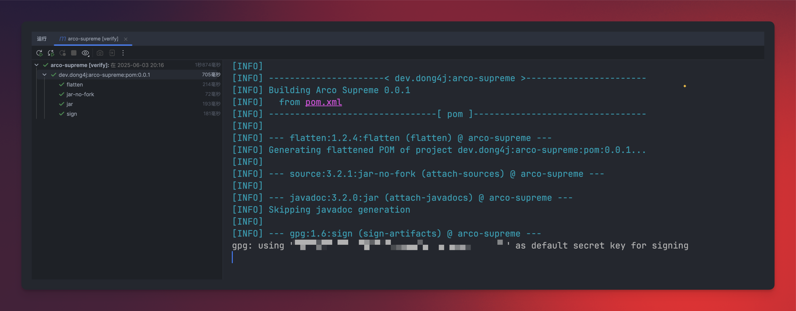

此插件在 `verify` 阶段生效:

1. **发布者用私钥对内容进行签名**
    - GPG 首先对文件内容计算哈希（如 SHA-256）。
    - 然后用发布者的私钥加密这个哈希值，生成签名（.asc 文件）, 文件可以在 `./target/arco-supreme-0.0.1.pom.asc` 找到.
2. **使用者用公钥验证签名**
    - 下载者用发布者的公钥对签名进行解密，获得原始哈希值。
    - 然后本地重新计算 jar 包的哈希值进行比对。
    - 如果两个哈希一致，说明：
        - 内容没有被篡改（完整性）
        - 签名是由持有私钥的人生成的（身份验证）

---

### 🛠️ 其他插件

```xml
<plugin>
    <groupId>org.apache.maven.plugins</groupId>
    <artifactId>maven-source-plugin</artifactId>
    <version>${maven-source-plugin.version}</version>
    <executions>
        <execution>
            <id>attach-sources</id>
            <goals>
                <goal>jar-no-fork</goal>
            </goals>
        </execution>
    </executions>
</plugin>
<plugin>
    <groupId>org.apache.maven.plugins</groupId>
    <artifactId>maven-javadoc-plugin</artifactId>
    <version>${maven-javadoc-plugin.version}</version>
    <executions>
        <execution>
            <id>attach-javadocs</id>
            <goals>
                <goal>jar</goal>
            </goals>
            <configuration>
                <!--不显示javadoc警告-->
                <additionalOptions>-Xdoclint:none</additionalOptions>
                <additionalJOption>-Xdoclint:none</additionalJOption>
            </configuration>
        </execution>
    </executions>
</plugin>
```

---

### 📄 pom.xml 的具体要求

可以先看看 [官方文档](https://central.sonatype.org/publish/requirements/). 其实主要是提供一些元数据标签, 当发布到 Maven 公共仓库时,
会根据这些元数据来展示相应的数据, 比如:  
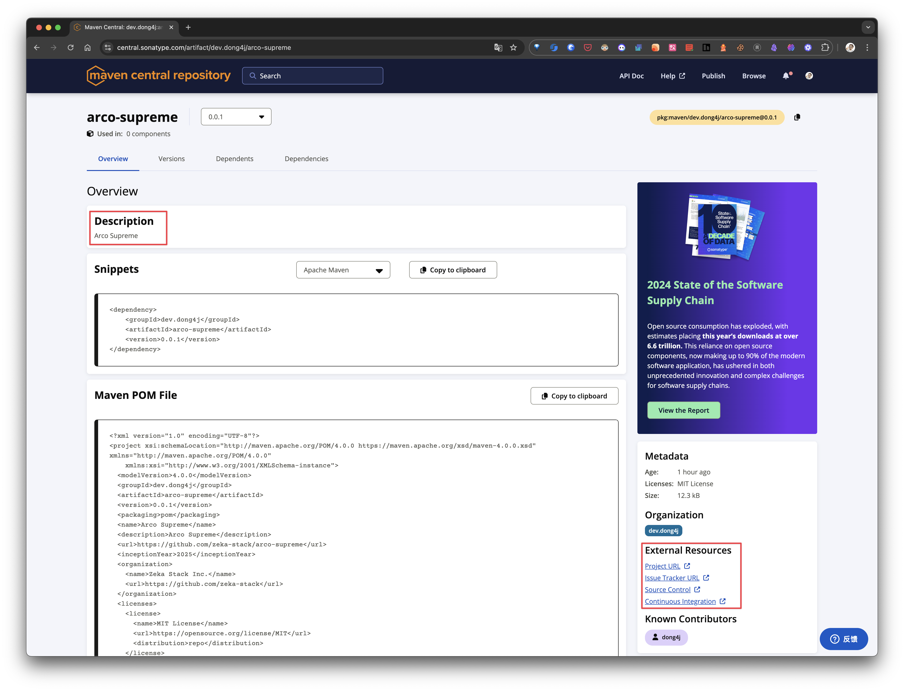

按照官方的要求, 我整理了一个 `pom.xml` 模板:

```xml
<?xml version="1.0" encoding="UTF-8"?>
<project xmlns="http://maven.apache.org/POM/4.0.0"
         xmlns:xsi="http://www.w3.org/2001/XMLSchema-instance"
         xsi:schemaLocation="http://maven.apache.org/POM/4.0.0 http://maven.apache.org/xsd/maven-4.0.0.xsd">

    <modelVersion>4.0.0</modelVersion>

    <!-- Inherit from parent project -->
    <parent>
        <groupId>dev.dong4j</groupId>
        <artifactId>arco-supreme</artifactId>
        <version>0.0.1-SNAPSHOT</version>
        <relativePath/>
    </parent>

    <!-- Project coordinates -->
    <artifactId>${artifactId}</artifactId>
    <version>${DS}{revision}</version>
    <packaging>pom</packaging>

    <!-- Project metadata -->
    <name>${projectname}</name>
    <description>${projectname}</description>
    <url>https://github.com/zeka-stack/${artifactId}</url>
    <inceptionYear>${YEAR}</inceptionYear>

    <!-- Organization -->
    <organization>
        <name>Zeka Stack Inc.</name>
        <url>https://github.com/zeka-stack</url>
    </organization>

    <!-- License -->
    <licenses>
        <license>
            <name>MIT License</name>
            <url>https://opensource.org/license/MIT</url>
            <distribution>repo</distribution>
        </license>
    </licenses>

    <!-- Developers -->
    <developers>
        <developer>
            <id>dong4j</id>
            <name>dong4j</name>
            <email>dong4j@gmail.com</email>
            <organization>Zeka.Stack</organization>
            <organizationUrl>https://github.com/zeka-stack</organizationUrl>
            <roles>
                <role>designer</role>
                <role>developer</role>
            </roles>
        </developer>
    </developers>

    <!-- SCM (Source Control Management) -->
    <scm>
        <url>https://github.com/zeka-stack/${artifactId}</url>
        <connection>scm:git:https://github.com/zeka-stack/${artifactId}.git</connection>
        <developerConnection>scm:git:git@github.com:zeka-stack/${artifactId}.git</developerConnection>
        <tag>HEAD</tag>
    </scm>

    <!-- Issue tracking -->
    <issueManagement>
        <system>GitHub Issues</system>
        <url>https://github.com/zeka-stack/${artifactId}/issues</url>
    </issueManagement>

    <!-- CI/CD system -->
    <ciManagement>
        <system>GitHub Actions</system>
        <url>https://github.com/zeka-stack/${artifactId}/actions</url>
    </ciManagement>

    <!-- Contributors (optional) -->
    <contributors>
        <contributor>
            <name>dong4j</name>
            <email>dong4j@gmail.com</email>
            <url>https://github.com/dong4j</url>
            <organization>Zeka.Stack</organization>
            <roles>
                <role>maintainer</role>
            </roles>
        </contributor>
    </contributors>

    <!-- Project modules -->
    <modules>
        
    </modules>

    <!-- Project properties -->
    <properties>
        <revision>0.0.1-SNAPSHOT</revision>
    </properties>
</project>
```

可以添加到 IDEA 的 `代码模板` 中, 简化 pom.xml 的创建工作:  
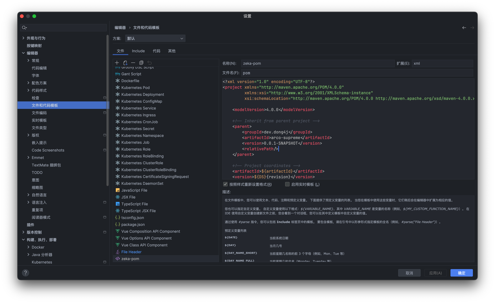

---

## 📦 发布到 Maven 中央仓库

- 执行 mvn clean deploy 命令，进行打包并上传。

  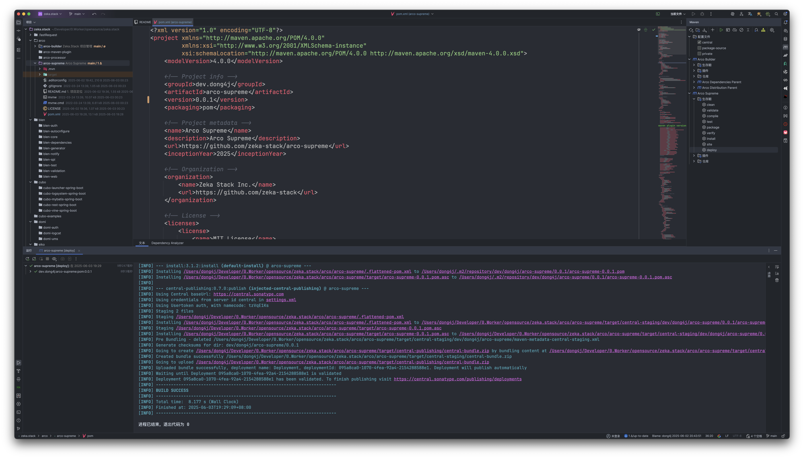

- 如果配置了 `autoReleaseAfterClose` 为 true，则不需要到控制台手动验证。

  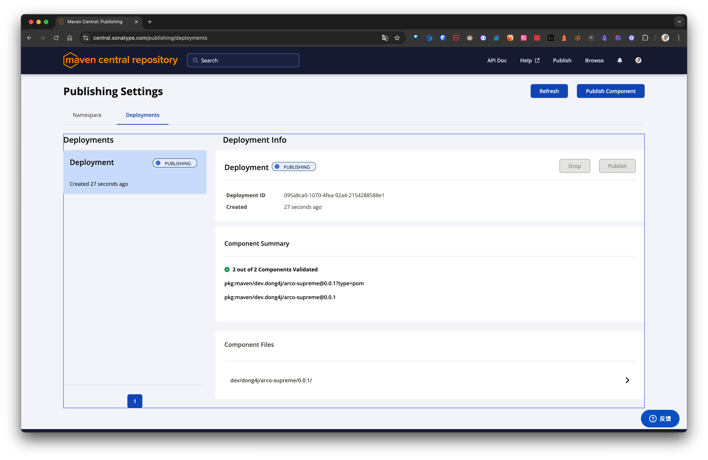

- 等待同步，通常 30 分钟内可在 Maven 中央仓库下载，最多 4 小时后可在搜索中找到。


---

## 🔄 发布 SNAPSHOT

前面我们都是按照正式版发布流程来验证部署的, 但是在开发过程中肯定存在快照版本, 可供小伙伴测试使用. 而要在 Maven
中央仓库发布快照需要额外的配置:


然后修改 pom.xml 中的 `version`:

```xml
<groupId>dev.dong4j</groupId>
<artifactId>arco-supreme</artifactId>
<version>0.0.1-SNAPSHOT</version>
<packaging>pom</packaging>
```

这样你就可以无限制的上传快照了, 值的注意的是:

1. 快照版本的组件无法在 `Deployments` 中查看;
   需要在 [这里查看](https://central.sonatype.com/service/rest/repository/browse/maven-snapshots/)
2. `release` 版本的组件只要成功部署就不能删除, 同版本的包无法覆盖;

---

## 🧾 总结

以上就是如何将自己的 jar 组件上传到 Maven 公共仓库, 其实也非常简单, 按照官方教程操作一步步来也没有任何难度. 值得说的就是我遇到的问题:

1. 快照版本没有在 `Deployments` 页面显示, 我甚至怀疑是不是我上传失败了, 但是 `deploy` 日志又显示为成功, 后来删除 `-SNAPSHOT` 再 `deploy`
   后就能看到了;
2. Maven 公共仓库不同于公司的私服, 私服可以配置 `release` 允许覆盖和删除. 而公共仓库服务于全球, 一旦 jar 包被其他开发者使用就不能撤回, 所
   Maven 中央仓库是不允许删除 `release` 的 jar 包的, 且只能使用 [Semantic Versioning](https://semver.org/) 的方式来修复错误,
   具体可见 [Immutability of Published Components](https://central.sonatype.org/publish/requirements/immutability/#alternatives-to-removal-or-modification-of-components)
   和 [# Can I change, modify, delete, remove, or update a component on Central?](https://central.sonatype.org/faq/can-i-change-a-component/)

这篇文章只是一个基础教程, 接下来我将对 `pom.xml` 进行更高阶的配置, 以满足企业 Maven 私服部署, 以及使用 `.mvn` 来避免本地 Maven 版本不适配的等问题.

## 📚 参考

[maven central repository Documentation](https://central.sonatype.org/publish/publish-portal-guide/)
