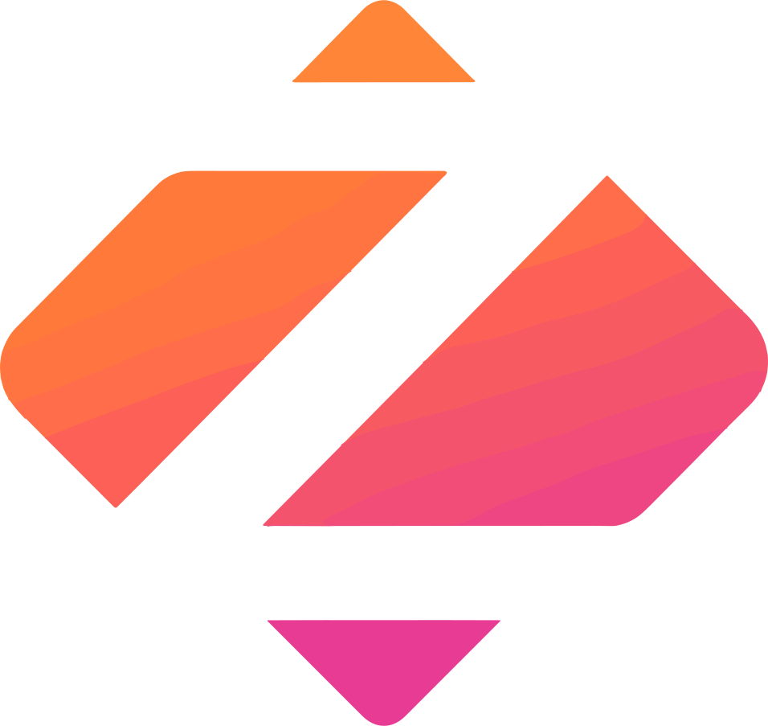

  

  <h1>🔥 Zeka.Stack <small>1.0.0</small></h1>
  <h3>🚀 企业级 Java 开发脚手架，让 Spring Boot 开发更简单、更高效</h3>

  
  
  
  

  

    <h3>🏗️ 模块化设计</h3>
    
11个独立模块，按需引入，清晰的模块边界和职责

  

  

    <h3>⚡ 开箱即用</h3>
    
基于Spring Boot自动配置，零配置即可使用

  

  

    <h3>🛡️ 企业级特性</h3>
    
统一的异常处理、参数验证、代码生成等企业级功能

  

  

    <h3>🔧 开发友好</h3>
    
丰富的工具类、详细文档、完善的错误提示

  

  

    <h3>🎯 一致体验</h3>
    
统一的开发规范，确保团队协作的一致性和可维护性

  

  

    <h3>📋 约定优于配置</h3>
    
遵循最佳实践，减少配置复杂度，提高开发效率

  

  

    <h3>📚 规范先行</h3>
    
内置代码规范检查，统一的编码风格和项目结构

  

  

    <h3>🚀 提质增效</h3>
    
自动化工具链，减少重复劳动，专注业务逻辑开发

  

  

    <h3>🔒 安全可靠</h3>
    
内置安全机制，敏感数据加密，SQL注入防护

  

  

    <h3>📊 监控完善</h3>
    
完整的日志系统，性能监控，健康检查端点

  

  

    <h3>🔄 热更新</h3>
    
支持配置热更新，无需重启即可生效配置变更

  

  

    <h3>🌐 多技术栈</h3>
    
支持Servlet和Reactive两种Web技术栈，灵活选择

  

  <a href="#/guide/" class="btn btn-primary">快速开始</a>
  <a href="https://github.com/zeka-stack" class="btn btn-secondary" target="_blank">GitHub</a>
  <a href="#/component/arco/" class="btn btn-outline">组件文档</a>

  <h3>🏛️ 架构体系</h3>
  

    

      <h4>Arco Meta</h4>
      
构建体系与依赖管理

    

    

      <h4>Blen Kernel</h4>
      
核心工具集与基础功能

    

    

      <h4>Cubo Starter</h4>
      
Spring Boot Starter 组件

    

    

      <h4>Domi Suite</h4>
      
微服务基础能力层

    

    

      <h4>Eiko Orch</h4>
      
中间件与基础设施

    

    

      <h4>Felo Space</h4>
      
业务系统模块

    

    

      <h4>Cubo Starter Examples</h4>
      
完善的单元测试与示例

    

    

      <h4>Supports</h4>
      
完善的支撑与自动化脚本

    

  

  

    <a href="https://blog.dong4j.site" target="_blank" class="link-item">
      📝
      博客
    </a>
    <a href="https://home.dong4j.site" target="_blank" class="link-item">
      🏠
      个人主页
    </a>
    <a href="https://resume.dong4j.site" target="_blank" class="link-item">
      📄
      个人履历
    </a>
  

