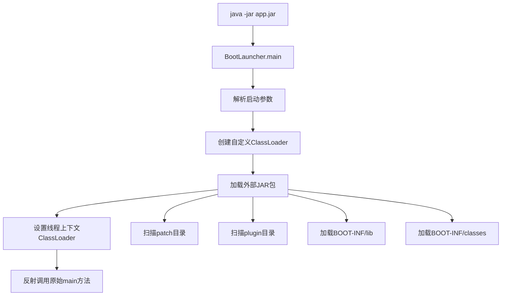

<!-- autoHeader:1 -->

# Arco Boot Maven Plugin

## 项目背景

在传统的服务器部署环境中，同一台服务器上会部署多个 Spring Boot 应用，这些应用往往有很多公共的 JAR 依赖（如 Spring Framework、MyBatis、Jackson
等）。每个应用都包含完整的依赖会导致：

1. **存储空间浪费**：相同的 JAR 包被多次存储
2. **部署时间长**：每次部署都需要传输大量重复的依赖包
3. **内存占用高**：JVM 需要为每个应用加载相同的类文件

`arco-boot-maven-plugin` 正是为了解决这些问题而设计的动态 JAR 加载插件。它通过将应用代码与公共依赖分离，实现了**公共依赖共享**和**动态类路径加载**。

> **注意**：随着 Docker 容器化技术的普及，现在更推荐使用 Docker 来部署业务服务，提倡隔离性。但该插件在动态加载 JAR 的实现上仍具有很好的参考价值。

## 功能特性

### 核心功能

- **JAR 重新打包**：将应用 JAR 重新组织结构，分离业务代码和框架代码
- **动态类路径扩展**：支持从外部目录（patch/plugin）动态加载 JAR 包
- **热补丁支持**：支持运行时加载补丁包，实现热修复
- **插件化架构**：支持插件机制，便于功能扩展

### 技术特点

- **自定义类加载器**：基于 `LaunchedURLClassLoader` 实现的动态类加载
- **Archive 抽象**：统一的归档文件处理机制
- **优先级控制**：patch 和 plugin 中的 JAR 优先级高于 lib 目录
- **配置驱动**：支持通过配置文件灵活控制类路径

## 项目结构

```
arco-boot-maven-plugin/
├── arco-boot-loader/           # 类加载器核心实现
│   ├── boost/                  # 启动增强器
│   │   └── BootLauncher.java   # 主启动类
│   ├── loader/                 # 类加载器实现
│   │   ├── archive/            # 归档文件抽象
│   │   ├── jar/                # JAR 文件处理
│   │   ├── Launcher.java       # 启动器基类
│   │   └── PropertiesLauncher.java  # 属性配置启动器
│   └── ...
└── arco-boot-maven-plugin/     # Maven 插件实现
    ├── boost/                  # 重打包工具
    │   ├── BootSlotter.java    # JAR 重新打包器
    │   └── IOKit.java          # I/O 工具类
    └── LauncherJarRepackageMojo.java  # Maven Mojo
```

## 工作原理

### 1. JAR 重新打包过程

插件会将原始的 Spring Boot JAR 重新打包，改变其内部结构：

**原始结构：**

```
app.jar
├── BOOT-INF/
│   ├── classes/           # 应用类
│   └── lib/              # 依赖 JAR
├── META-INF/
│   └── MANIFEST.MF       # Main-Class: com.example.Application
└── org/springframework/  # Spring Boot Loader
```

**重新打包后：**

```
app.jar
├── BOOT-INF/
│   └── classes/          # 原应用的所有类文件
├── META-INF/
│   └── MANIFEST.MF       # Main-Class: BootLauncher, Start-Class: com.example.Application
└── dev/dong4j/zeka/maven/plugin/boot/
    ├── boost/            # 启动增强器
    └── loader/           # 类加载器实现
```

### 2. 动态类加载流程



### 3. 类加载优先级

类加载器按以下优先级加载类：

1. **patch/** 目录中的 JAR（最高优先级，用于热修复）
2. **plugin/** 目录中的 JAR（用于功能扩展）
3. **BOOT-INF/lib/** 中的依赖 JAR
4. **BOOT-INF/classes/** 中的应用类

## 使用方式

### 1. Maven 插件配置

在项目的 `pom.xml` 中添加插件：

```xml
<plugin>
    <groupId>dev.dong4j</groupId>
    <artifactId>arco-boot-maven-plugin</artifactId>
    <version>${arco.version}</version>
    <executions>
        <execution>
            <goals>
                <goal>jar-repackage</goal>
            </goals>
        </execution>
    </executions>
    <configuration>
        <!-- 可选配置 -->
        <sourceDir>${project.build.directory}</sourceDir>
        <sourceJar>${project.build.finalName}.jar</sourceJar>
        <skip>false</skip>
    </configuration>
</plugin>
```

### 2. 构建项目

```bash
mvn clean package
```

构建完成后会生成：

- `target/app.jar`：重新打包的可执行 JAR
- `target/app.jar.original`：原始的 Spring Boot JAR
- `target/patch/`：补丁目录（空）
- `target/plugin/`：插件目录（空）

### 3. 部署和启动

#### 基础启动

```bash
java -jar app.jar
```

#### 指定外部依赖目录

```bash
java -jar app.jar \
  --slot.root=/opt/app/ \
  --slot.path=patch/ \
  --slot.path=plugin/ \
  --slot.path=common-lib/
```

#### 目录结构示例

```
/opt/app/
├── app.jar
├── patch/              # 热修复补丁
│   └── bugfix-1.0.jar
├── plugin/             # 功能插件
│   └── report-plugin.jar
└── common-lib/         # 公共依赖
    ├── spring-core-5.3.21.jar
    ├── mybatis-3.5.10.jar
    └── jackson-core-2.13.3.jar
```

## 配置说明

### 启动参数

| 参数                   | 说明          | 示例                      |
|----------------------|-------------|-------------------------|
| `--slot.root=<path>` | 指定根目录       | `--slot.root=/opt/app/` |
| `--slot.path=<path>` | 指定扩展路径（可多个） | `--slot.path=patch/`    |

### 配置文件支持

支持通过 `loader.properties` 文件进行配置：

```properties
# 类路径扩展
loader.path=patch/,plugin/,common-lib/

# 主类指定（通常自动检测）
loader.main=com.example.Application

# 主目录
loader.home=/opt/app

# 调试模式
loader.debug=true
```

配置文件查找顺序：

1. `file:${loader.home}/loader.properties`
2. `classpath:loader.properties`
3. `classpath:BOOT-INF/classes/loader.properties`

## 实现细节

### 核心类说明

#### 1. BootLauncher

- **作用**：主启动类，`java -jar` 的入口点
- **功能**：解析启动参数，创建扩展的类加载器
- **扩展**：支持 `--slot.root` 和 `--slot.path` 参数

#### 2. BootSlotter

- **作用**：JAR 重新打包器
- **功能**：
    - 将原始 JAR 中的类文件移动到 `BOOT-INF/classes/`
    - 嵌入启动器和类加载器相关类
    - 修改 `MANIFEST.MF` 文件

#### 3. PropertiesLauncher

- **作用**：属性配置驱动的启动器
- **功能**：
    - 支持多种配置源（系统属性、配置文件、Manifest）
    - 动态构建类路径
    - 支持嵌套 JAR 处理

#### 4. Archive 抽象

- **JarFileArchive**：处理 JAR 文件
- **ExplodedArchive**：处理目录结构
- **统一接口**：提供一致的归档文件访问方式

### 类加载器层次结构

```
LaunchedURLClassLoader (自定义)
└── urls: [patch/*.jar, plugin/*.jar, BOOT-INF/lib/*.jar, BOOT-INF/classes/]
    └── parent: AppClassLoader (系统类加载器)
        └── parent: ExtClassLoader
            └── parent: BootstrapClassLoader
```

## 插件机制

支持三种插件实现方式：

### 1. IoC 方式

```java
// 母体应用声明接口
public interface ReportService {
    void generateReport();
}

// 插件实现
@Service
public class PdfReportService implements ReportService {
    @Override
    public void generateReport() {
        // PDF 报表实现
    }
}

// 母体应用注入
@Autowired
private ReportService reportService;
```

### 2. SPI 方式

```java
// META-INF/services/com.example.ReportService
com.example.plugin.PdfReportService

// 加载插件
ServiceLoader<ReportService> services = ServiceLoader.load(ReportService.class);
```

### 3. AOP 方式

```java
@Aspect
@Component
public class PerformanceAspect {
    @Around("@annotation(Monitored)")
    public Object monitor(ProceedingJoinPoint pjp) throws Throwable {
        // 性能监控逻辑
    }
}
```

## 最佳实践

### 1. 目录规划

```
/opt/apps/
├── common-lib/          # 公共依赖库
│   ├── spring/
│   ├── mybatis/
│   └── jackson/
├── app1/
│   ├── app1.jar
│   ├── patch/
│   └── plugin/
└── app2/
    ├── app2.jar
    ├── patch/
    └── plugin/
```

### 2. 版本管理

- **公共依赖**：统一版本管理，定期升级
- **补丁包**：明确版本号，记录修复内容
- **插件**：独立版本控制，向后兼容

### 3. 安全考虑

- **路径校验**：防止路径遍历攻击
- **签名验证**：验证 JAR 包完整性
- **权限控制**：限制外部 JAR 的执行权限

## 性能优化

### 1. 类加载优化

- **预加载**：启动时预加载常用类
- **缓存机制**：缓存类查找结果
- **延迟加载**：按需加载插件类

### 2. 内存优化

- **共享依赖**：多应用共享公共依赖
- **类卸载**：支持插件的动态卸载
- **内存监控**：监控类加载器内存使用

## 故障排查

### 1. 调试模式

```bash
java -Dloader.debug=true -jar app.jar
```

### 2. 常见问题

#### ClassNotFoundException

- **原因**：类路径配置错误或 JAR 包缺失
- **解决**：检查 `loader.path` 配置和目录结构

#### NoClassDefFoundError

- **原因**：依赖冲突或版本不兼容
- **解决**：使用 `--slot.path` 调整加载优先级

#### SecurityException

- **原因**：安全管理器限制
- **解决**：配置安全策略或禁用安全管理器

## 与 Spring Boot 对比

| 特性   | Spring Boot 默认 | Arco Boot Plugin |
|------|----------------|------------------|
| 依赖打包 | Fat JAR 全包含    | 分离式打包            |
| 类加载  | 固定类路径          | 动态扩展类路径          |
| 热更新  | 不支持            | 支持 patch 机制      |
| 插件化  | 编译时确定          | 运行时加载            |
| 部署体积 | 大（包含所有依赖）      | 小（共享依赖）          |
| 启动速度 | 快              | 略慢（需扫描外部 JAR）    |
| 适用场景 | 容器化部署          | 传统服务器部署          |

## 适用场景

- **传统服务器部署环境**：多应用共享服务器资源
- **公共依赖共享**：减少存储和内存占用
- **热修复需求**：生产环境不停机修复
- **插件化架构**：运行时扩展功能

## 总结

`arco-boot-maven-plugin` 通过重新组织 JAR 包结构和自定义类加载器，实现了：

1. **依赖共享**：减少存储空间和内存占用
2. **动态扩展**：支持运行时加载新功能
3. **热修复**：支持不停机的补丁更新
4. **插件化**：提供灵活的扩展机制

虽然在容器化时代这种方案不是主流，但其在类加载器设计、动态扩展机制等方面的实现仍具有很高的学习和参考价值。对于理解 Java 类加载机制、Spring Boot
启动原理等都有很好的帮助。
