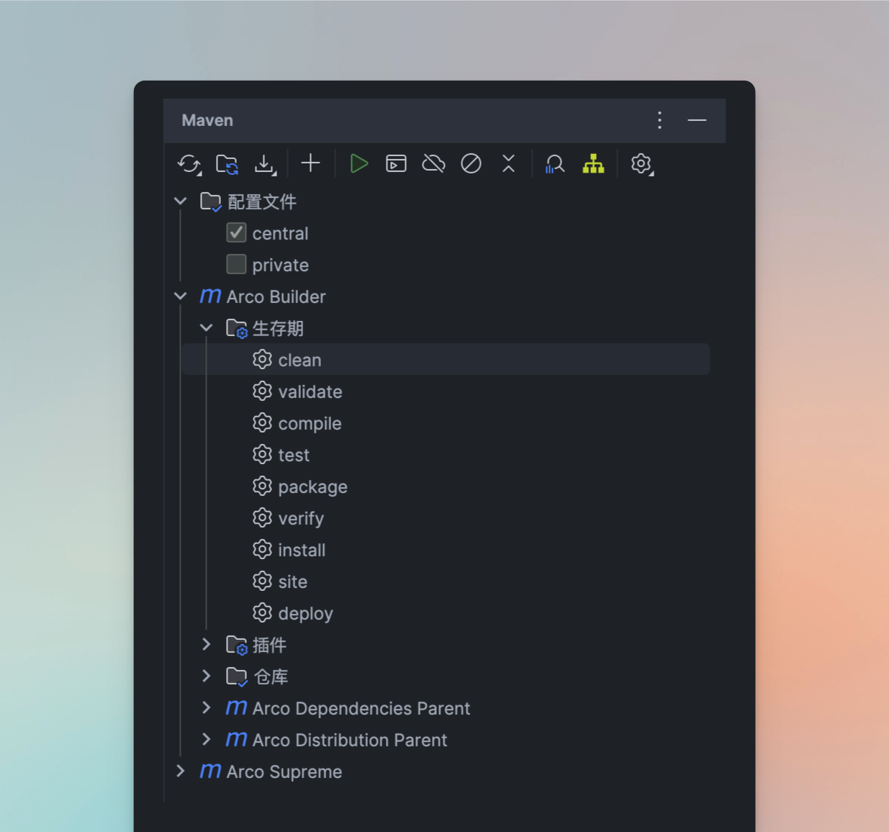

## 📖 简介

在上一篇 [🚀 从注册到发布：Maven 中央仓库上传 jar 实践](../2.从零注册到发布：Maven%20中央仓库上传%20jar%20实践/🚀%20从注册到发布：Maven%20中央仓库上传%20jar%20实践.md)
中，我们成功将本地 jar 包上传到了 Maven 公共仓库。

那篇文章的配置比较基础，主要目的是跑通流程。而在实际开发中，为了更好地适配不同环境，还需要做一些必要的优化配置。就像写代码一样，第一步是跑通，再逐步打磨细节，这次我们就来看看如何通过
Maven Profiles 实现多环境切换。

所以这篇文档我将介绍 Maven 的 Profiles 配置, 目标是让 Zeka.Stack 相关的组件既能上传到 Maven 公共仓库, 也能让大家在进行二次开发后, 只上传到公司
Maven 私服.

当然这仅仅是 Maven 的 Profiles 的一个实际应用场景, 其他还比如 根据不同 Profile 引入或排除某些依赖; 针对多模块项目，通过 Profiles 控制是否构建某些子模块;
结合 resources 标签中的 `<filtering>true</filtering>`，实现配置文件模板化等等场景.

## 🔀 deploy 环境切换

直接上配置:

```xml
<!-- 通过配置切换部署的仓库 -->
<profiles>
    <!-- 配置方式: https://central.sonatype.org/register/central-portal/ -->
    <profile>
        <id>central</id>
        <build...>
    </profile>
    <!-- 公司 maven 私服配置 -->
    <profile>
        <id>private</id>
        <distributionManagement...>                
    </profile>
</profiles>
```

我的目的非常简单:

1. 我在维护 Zeka.Stack 项目时, 为了方便大家单独使用某些组件, 最简单的方式就是上传到 Maven 公共仓库, 这样大家就不需要本地编译了, 所以我的第一个配置就是
   `central`, 里面是将 jar 包部署到 Maven 公共仓库所必须的插件;
2. 等 Zeka.Stack 做大做强之后, 有些小伙伴就会 clone 源码进行二次开发, 修改为自己的脚手架, 那就得部署到公司的 Maven 私服, 所以第二个配置就是
   `private`, 用于添加公司的 `distributionManagement` 配置.

**你就说我考虑的周不周到吧.**

你也别使用命令行操作 mvn 了, 因为每次还要加上 `-P` 参数, 不可能现在还没有用 IDEA 开发 Java 项目的小伙伴吧. 在 IDEA 的 Maven 面板可以方便的选择
Profiles:



### ⚙️ settings.xml 配置

要实现我上面的目标, 单单在 pom.xml 中添加 profiles 是无法实现的, 因为上传 Maven 仓库还需要认证的配置, 所以我们还需要配置 `settings.xml`:

```xml
<?xml version="1.0" encoding="UTF-8"?>
<settings xmlns="http://maven.apache.org/SETTINGS/1.0.0"
          xmlns:xsi="http://www.w3.org/2001/XMLSchema-instance"
          xsi:schemaLocation="http://maven.apache.org/SETTINGS/1.0.0 http://maven.apache.org/xsd/settings-1.0.0.xsd">

    <servers>
        <!-- 公共仓库 -->
        <server>
            <id>central</id>
            <username>${env.MVN_CENTRAL_USERNAME}</username>
            <password>${env.MVN_CENTRAL_PASSWORD}</password>
        </server>

        <!-- 私服 snapshots -->
        <server>
            <id>snapshots</id>
            <username>${env.MVN_PRIVATE_USERNAME}</username>
            <password>${env.MVN_PRIVATE_PASSWORD}</password>
        </server>
        <!-- 私服 releases -->
        <server>
            <id>releases</id>
            <username>${env.MVN_PRIVATE_USERNAME}</username>
            <password>${env.MVN_PRIVATE_PASSWORD}</password>
        </server>
    </servers>
</settings>
```

这里为啥使用 `${env.xxx}` 环境变量? `settings.xml` 不是存储在本地的吗? 如果使用环境变量来保证安全性是不是太画蛇添足了?

你是不是满脸问号? 就像他一样


既然使用了环境变量来保证安全性, 我肯定是将 `settings.xml` 放在了项目中, 至于为什么这样做,
我想在 [[🧨 你可能忽略的 .mvn：Maven 本地化配置的秘密与坑点解析]] 一文中分享我的想法.

---

## 📦 依赖切换

另一个比较常见的场景是这样的:

人大金仓的数据库都用过吧, 你说你没用过? 那你一定没开发过政府项目.

我们生产环境使用的数据库是 **人大金仓**, 而开发和测试环境则使用的 `PostgreSQL`, 你问我为啥不在开发和测试环境也部署一套 **人大金仓**, 我只能说
**得加钱**.

所以这就出现了一个问题: 负责部署的同学还要手动修改 pom.xml 的依赖来打包:

1. 非生产环境把 `kingbase8` 依赖注释掉, 取消 `postgresql` 的依赖注释;
2. 生产环境打包时则反过来;

你就说这是不是人干的事? 这完全可以通过 Maven Profiles 来解决:

```xml
<profiles>
    <profile>
        <id>kingbase</id>
        <dependencies>
            <dependency>
                <groupId>cn.com.kingbase</groupId>
                <artifactId>kingbase8</artifactId>
            </dependency>
        </dependencies>
    </profile>
    <profile>
        <id>pgsql</id>
        <dependencies>
            <dependency>
                <groupId>org.postgresql</groupId>
                <artifactId>postgresql</artifactId>
            </dependency>
        </dependencies>
    </profile>
</profiles>
```

打包时可以直接操作 IDEA 来选择不同的依赖, 如果有 CI/CD 环境, 使用 `-P` 配置即可.

---

## 📌 Profiles 必知必会

通过上面 2 个案例, 我们了解到 Maven Profiles 的部分使用方式, 如果想详细了解 Profiles
的话, [官方文档](https://maven.apache.org/guides/introduction/introduction-to-profiles.html) 肯定是要看一遍的, 我这里总结了几个经常使用到的知识点,
扩充一下非主线知识库.

### 🧩 多 profiles 同时激活

> All profile elements in a POM from active profiles overwrite the global elements with the same name of the POM or extend those in case of
> collections. In case multiple profiles are active in the same POM or external file, the ones which are defined **later** take precedence
> over the ones defined **earlier** (independent of their profile id and activation order).
>
> > 翻译过来就是:
> >
> > 当某个 POM 中的 profile 被激活后，profile 中的配置会覆盖 POM 中同名的全局元素；对于集合类型的元素，则是扩展（合并）。如果同时激活了多个
> > profile，那么定义在后面的 profile 会覆盖前面定义的（无论 profile 的 ID 和激活顺序如何）。

上面的描述分为下面 3 种情况.

#### 🧹 覆盖原配置

POM 中被激活的 profile 里的元素，会覆盖 POM 中同名的全局配置项.

```xml
<build>
  <finalName>default-name</finalName>
</build>

<profiles>
  <profile>
    <id>prod</id>
    <build>
      <finalName>prod-name</finalName>
    </build>
  </profile>
</profiles>
```

如果激活 prod profile，`<finalName>` 就会变成 prod-name，覆盖掉全局的 default-name。

#### ➕ 追加配置

如果是集合类型（如 ` <plugins>, <dependencies>`），则不是替换，而是追加.

```xml
<dependencies>
  <dependency>...</dependency>
</dependencies>

<profile>
  <id>dev</id>
  <dependencies>
    <dependency>...</dependency> <!-- 追加，而非替换 -->
  </dependencies>
</profile>
```

#### 🎯 优先级

如果激活了多个 profile，并且它们在同一个 POM 或外部文件中定义，那么**后定义的 profile 的配置优先生效**，即使它的 `<id>`
比前面的字母靠前、或激活顺序早，也不会改变这一规则。

```xml
<profiles>
  <profile>
    <id>first</id>
    <properties>
      <env.name>first</env.name>
    </properties>
  </profile>
  <profile>
    <id>second</id>
    <properties>
      <env.name>second</env.name>
    </properties>
  </profile>
</profiles>
```

如果两个 profile 都被激活了，最终 ` env.name=second`，因为 second profile 是后来定义的。

---

所以问题来了, 下面的配置我如果同时激活 `central` 和 `private` 的话, 会出现什么情况:

```xml
<!-- 通过配置切换部署的仓库 -->
<profiles>
    <!-- 配置方式: https://central.sonatype.org/register/central-portal/ -->
    <profile>
        <id>central</id>
        <build>
            <plugins>
                <plugin>
                    <groupId>org.sonatype.central</groupId>
                    <artifactId>central-publishing-maven-plugin</artifactId>
                    ...
                </plugin>
                <!-- 下面 3 个插件是 maven 公共仓库必须的 -->
                <plugin>
                    <groupId>org.apache.maven.plugins</groupId>
                    <artifactId>maven-gpg-plugin</artifactId>
                    ...
                </plugin>
                <plugin>
                    <groupId>org.apache.maven.plugins</groupId>
                    <artifactId>maven-source-plugin</artifactId>
                    ...
                </plugin>
                <plugin>
                    <groupId>org.apache.maven.plugins</groupId>
                    <artifactId>maven-javadoc-plugin</artifactId>
                    ...
                </plugin>
            </plugins>
        </build>
    </profile>
    <!-- 公司 maven 私服配置 -->
    <profile>
        <id>private</id>
        <distributionManagement>
            <snapshotRepository>
                <id>snapshots</id>
                <url>https://xxx.maven.com/nexus3/repository/snapshot/</url>
                ...
            </snapshotRepository>
            <repository>
                <id>releases</id>
                <url>https://xxx.maven.com/nexus3/repository/release/</url>
                ...
            </repository>
        </distributionManagement>
    </profile>
</profiles>
```

1. 因为 central 和 private 分别配置了 **不同的构建元素**（`<build>` vs `<distributionManagement>`），**它们会“合并生效”**，而不是互相覆盖。
2. 项目新增了 `central-publishing-maven-plugin` 等在内的 maven plugin;
3. Maven **只允许有一个 `<distributionManagement>`**，所以只要 private 中配置了，它就会覆盖掉默认或全局的设置。

如果 `distributionManagement` 的 url 不是一个有效的地址的话, 那么 deploy 阶段就会报错, 虽然 `central-publishing-maven-plugin` 内部也会执行
deploy 操作, 但是必定不会执行这块逻辑, 所以你就知道了怎么配合使用 `central` 和 `private` 了:

1. 如果你想 deploy 到 Maven 私服, 同时开启和只开启 `private` 结果是一样的, 因为只会使用 `distributionManagement` 配置;
2. 如果只想 deploy 到 Maven 公共仓库, 记得只开启 `central`;

---

### 🔔 激活配置

#### 🧭 Explicit Activation

官方翻译过来是 **显式激活**, 也就是 **手动激活** 的意思. 按照官方的文档描述, 可以通过命名行参数 `-P` 来显式指定 profile, 也可以在
settings.xml 中配置 `activeProfiles`, 还可以在 pom.xml 中配置 `activeByDefault`.

经过上面一套组合拳下来后, 完全懵逼了, 比如我在 `settings.xml` 中配置为:

```xml
<activeProfiles>
  <activeProfile>central</activeProfile>
</activeProfiles>
```

然后在 pom.xml 配置了:

```xml
<profile>
    <id>private</id>
    <activation>
        <activeByDefault>true</activeByDefault>
    </activation>
    ...
</profile>
```

然后我使用 `mvn deploy -P private`, 最后到底使用了哪个 profile?

所以这里就引出了 Maven 中 profile 三个定义位置的优先级问题:

| **优先级** | **定义位置**                       | **说明**               |
|---------|--------------------------------|----------------------|
| 1️⃣     | 命令行参数 -P 激活的 profile           | 显式激活，优先级最高           |
| 2️⃣     | settings.xml 中定义的 profile（并激活） | 用户或系统级别配置，覆盖 pom.xml |
| 3️⃣     | pom.xml 中定义的 profile           | 项目本地配置，优先级最低         |

所以像我上面的配置的话, 当打开 IDEA 加载 Maven 项目时, 生效的 profile 应该是 `central`.

而 `activeByDefault` 可以理解为一个 **兜底配置**, 如果我没有手动选择的话 (在 IDEA 中勾选 `private` 配置), 则会优先使用 `settings.xml` 中配置的
`central` .

这里结合 3 个地方的配置做一个总结:

1. 命令行显式激活（最高优先级）

   ```xml
   mvn deploy -P private
   ```

    - 用 `-P` 指定 profile，可以一次激活多个（用逗号分隔）；
    - **会覆盖 POM 中 activeByDefault=true 的 profile**；
    - **与 settings.xml 中的 `<activeProfiles>` 并列生效**, 所以最终生效的是 `central` 和 `private`;

2. 在 settings.xml 中配置 `<activeProfiles>`

   ```xml

<settings>
 <activeProfiles>
   <activeProfile>central</activeProfile>
 </activeProfiles>
</settings>
   ```

- 定义了 profile ID 列表，只要使用 Maven，它们都会自动被激活；
- **不管项目里有没有定义该 profile，都尝试激活**（Maven 4 开始更严格，见下文）；
- 和命令行 `-P` 激活是 **并列的，不会被覆盖**。

3. POM 中的自动激活（activation 配置）

   ```xml
   <profile>
   <id>private</id>
   <activation>
       <activeByDefault>true</activeByDefault>
   </activation>
   …
   </profile>
   ```

    - 意味着 “如果没有其他 profile 被显式激活，就用我”；
    - 一旦有命令行 -P 或 settings.xml 中的 profile 被激活，该 activeByDefault 自动失效；
    - 类似“兜底默认配置”。

##### 🆕 Maven 4 的变化

> **Maven 4 开始，不存在的 profile ID 默认会报错！**

这就引出了这句：

```
mvn clean install -P profile-1,?profile-2
```

- `?profile-2`：如果 `profile-2` 存在就激活，如果不存在就忽略；
- 没加 ? 的 profile，如果不存在，会报错；
- 这个写法非常适合跨项目通用命令行，比如 CI/CD 中用到。

##### 📊 激活优先级和规则

| **激活方式**           | **示例**                                    | **优先级** | **是否会覆盖 default profile** |
|--------------------|-------------------------------------------|---------|---------------------------|
| ✅ 命令行 -P           | mvn install -P prod                       | 🔝 最高   | ✔ 会覆盖 `<activeByDefault>` |
| ✅ settings.xml 中配置 | `<activeProfile>dev</activeProfile>`      | 中等      | ✔ 会覆盖 `<activeByDefault>` |
| ✅ POM 中自动激活        | `<activeByDefault>true</activeByDefault>` | 最低      | ❌ 会被其他方式激活的 profile 自动禁用  |

##### 💡 实用建议

| **场景**                 | **推荐做法**                                    |
|------------------------|---------------------------------------------|
| 本地开发环境切换               | 用 -P dev, -P test 明确指定                      |
| 默认 profile 配置兜底        | 用 `<activeByDefault>true</activeByDefault>` |
| CI/CD 不确定 profile 存在与否 | 使用 `-P ?ci` 避免报错                            |
| 多开发者或多环境               | 使用 settings.xml 配置本地私有 profile 激活，无需改项目 POM |

---

#### 🌱 Implicit Profile Activation

翻译过来是: **隐式激活**, 也就是可以根据某些条件 **自动激活** 某个或某些 profile, 比如:

1. 根据操作系统

   ```xml

<activation>
 <os>
   <name>Windows 10</name>
 </os>
</activation>
   ```

2. 根据 JDK 版本

   ```xml

<activation>
 <jdk>1.8</jdk>
</activation>
   ```

3. 根据存在的文件

   ```xml
   <activation>
    <file>
   <exists>${basedir}/somefile.txt</exists>
    </file>
   </activation>
   ```

还有一些非主流的 **自动激活** 规则,
可以看看 [官方文档](https://maven.apache.org/guides/introduction/introduction-to-profiles.html#Implicit_profile_activation).

那么问题又来了, 比如我使用 os 来激活 `central` 配置 (不合理哈, 只是一个例子):

```xml
<profiles>
    <profile>
        <id>central</id>
        <activation>
          <os>
            <name>macos</name>
          </os>
        </activation>           
        ...
    </profile>
    <!-- 公司 maven 私服配置 -->
    <profile>
        <id>private</id>
        <activation>
            <activeByDefault>true</activeByDefault>
        </activation>
        ...
    </profile>
</profiles>
```

那我在 macOS 中执行 `mvn deploy -P private` 时哪个配置生效了?

值得说明的是 **隐式激活** 的生效规则:

- 取决于运行环境；
- 可以同时生效；
- **与显式激活的 profile 合并时，如果有重复字段，后定义的覆盖前者（如 plugin、property 等）**

所以答案是: `central` 和 `private`.

---

## 🌍 使用 profiles 切换环境

在早期项目中，我们常通过 Maven Profiles
来打包不同环境下的配置文件，例如 [这篇文章](https://blog.csdn.net/java_collect/article/details/83870215) 所描述的做法：为每个环境分别构建一个部署包。这确实是
Maven Profiles 的一种典型应用场景，但如今已不再推荐这样使用。

一方面，微服务架构普及后，配置中心已成为主流做法，本地配置逐渐被抽离。另一方面，即使是单体应用，我也不建议将特定环境的配置打进不同的包中。更现代、合理的做法是：

> **一次打包，多个环境复用。**

具体来说，就是在构建阶段将所有环境的配置文件一并打入部署包中，运行时通过 `--spring.profiles.active` 参数指定使用哪一套配置，而不是为每个环境分别构建和传包。

这种方式不仅符合 Java 的“**一次编译，到处运行**”理念，也让部署流程更简单、更一致：

> **一次打包，到处运行**，才是更优雅的交付策略。

---

### 🎒 关于配置文件打包的那点思考

可能有人会说：**生产环境的配置出于安全考虑，确实不应该打进部署包中，应该单独处理。**

没错，这种说法在一些有成熟流程和明确安全规范的公司确实成立。但我想说的是：**不是所有项目都有那么高的复杂度和敏感性。**

如果你的系统只是个简单的后台管理，业务逻辑主要是 CRUD，线上用户撑死不到 100 个，你还搞三套部署、分包打包、权限隔离，未免有点杀鸡用牛刀了。对这种情况，我反而更希望配置越简单越好，甚至一个
`application.yml` 解决所有问题，切换环境时手动改一下数据库地址，比维护一堆 profile + 配置模板高效得多 😂

#### 🧱 单体项目的典型处理方式

对于单体项目来说，通常由具备权限的人员负责打生产包，`application-prod.yml` 这类配置文件一般也不会提交到 Git（建议私下做好加密或备份），团队其他成员也就无法访问生产配置，
**天然就形成了隔离和权限控制。**

#### 🧬 微服务项目的常规做法

而在微服务场景下，**配置中心基本是标配**。不同环境的配置一般也分别托管在不同的命名空间或配置集群中，生产环境的访问权限严格控制，大多数开发人员并不具备读写权限，通常是由运维或负责人根据部署文档操作。

所以我实在不太能理解为什么要像 [这篇文章](https://blog.csdn.net/java_collect/article/details/83870215) 那样把配置打包过程搞得那么复杂。

当然，每家公司情况不同，技术负责人理念也不尽相同——**上面只是我个人的一些实践与偏好，如果你所在团队有不同做法，那你说的就是对的 😉。**

---

## 🧾 总结

我们通过 2 个实际案例了解了 Maven Profiles 的作用, 且结合官方文档明白了 profile 的优先级.

在 **激活配置** 这一节中，虽然列举了大量示例，但在实际开发中，普通项目往往用不到这么复杂的配置。更重要的是，我们也应该尽量避免过度设计，遵循 *
*KISS 原则** ——它不是教你“接吻”，而是提醒你要 **Keep It Simple, Stupid**：保持简单，专注本质，按需而行。

而且实在不知道最终哪个 profile 的生效的话, Maven 也有工具帮助我们:

```bash
mvn help:active-profiles -P xxx
mvn help:effective-pom
```

所以复杂的没必要自己去分析, 善用工具才能走的更远.

## 📚 参考

[Introduction to Build Profiles](https://maven.apache.org/guides/introduction/introduction-to-profiles.html)
