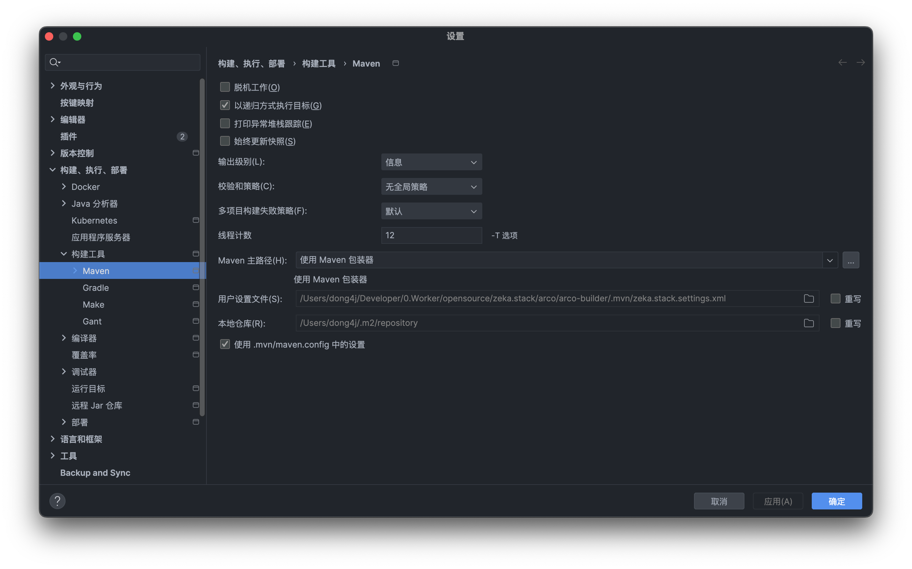
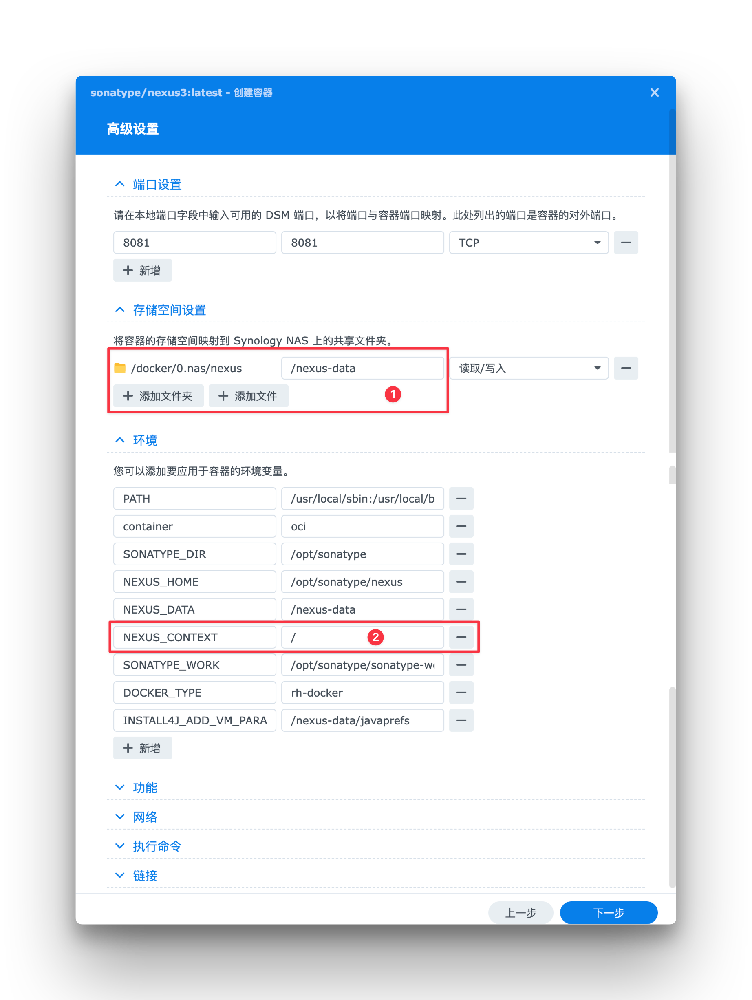
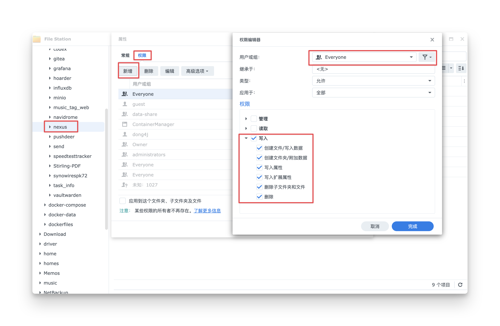
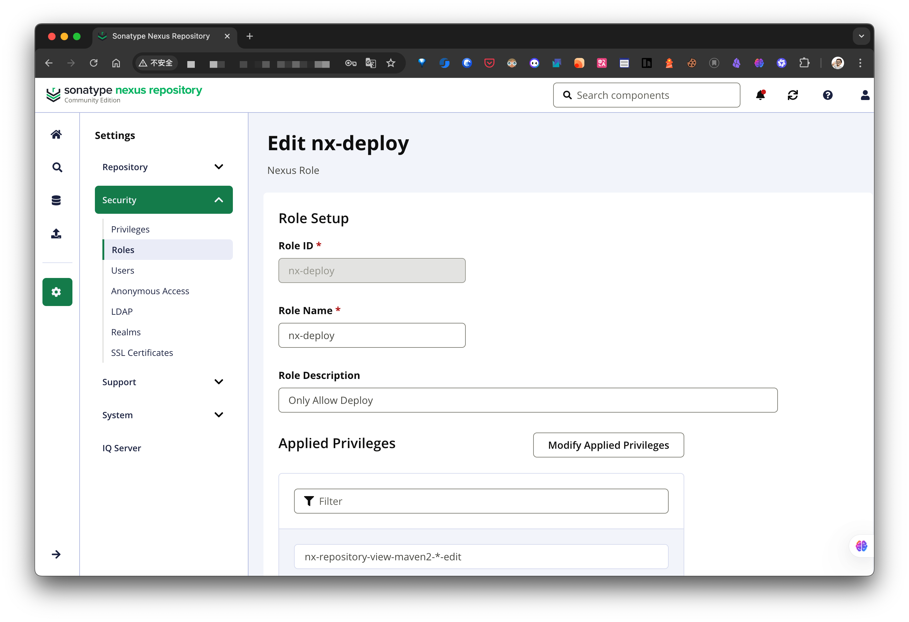
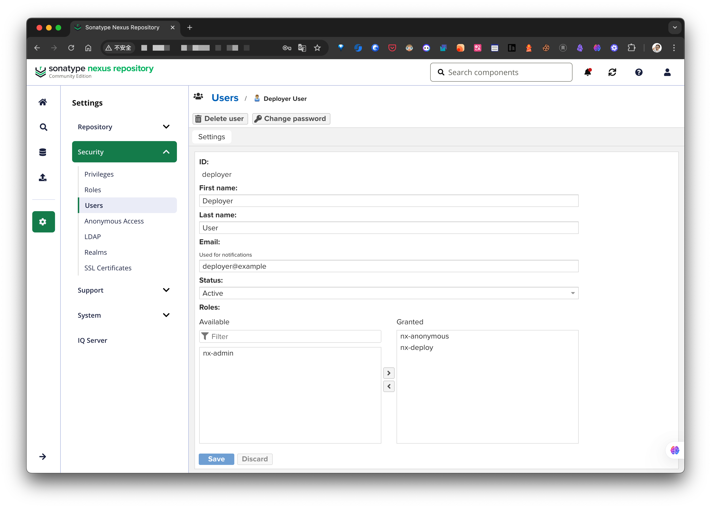

## 📖 简介

在上一篇 [[🧪 Maven Profiles 的使用场景案例分享]] 我们通过 Profiles 的实际案例大致了解了它的使用方式, 并详细梳理了 Profiles 的优先级,
不过也挖了一个坑: 为啥我要将 `settings.xml` 和项目代码放在一起?

比如 [arco-supreme](https://github.com/zeka-stack/arco-supreme) 项目的代码结构为:

```
$ tree -a -I '.git|.idea'
.
├── .editorconfig
├── .gitignore
├── .mvn
│   ├── jvm.config
│   ├── maven.config
│   ├── settings.xml
│   └── wrapper
│       ├── maven-wrapper.properties
│       └── MavenWrapperDownloader.java
├── LICENSE
├── mvnw
├── mvnw.cmd
├── pom.xml
└── README.md
```

可以看到 `settings.xml` 文件放在了 `.mvn` 目录下, 且通过 git 来管理.

为了解释我的想法, 需要先了解一下什么是 `.mvn`, 它与传统的 Maven 有什么区别.

---

## 🧠 理解 .mvn：它与传统 Maven 有何不同

在日常的 Java 项目开发中，Maven 是我们最常用的构建工具之一。我们习惯通过 pom.xml 来管理依赖、插件与构建逻辑，使用 `mvn clean install`
来构建项目。但在某些开源项目或大型企业项目中，我们常常会看到一个特殊的目录：`.mvn`。它不是 Maven 本身的替代，而是一种增强机制，用于项目级别的构建配置与定制。

那么，`.mvn` 究竟是什么？它与传统 Maven 配置有何区别？我们又该如何正确使用它？这篇文章将带你从实践视角出发，深入了解 `.mvn` 背后的设计理念与使用方式。

### 🔁 传统 Maven 使用方式回顾

在默认的 Maven 项目中，我们通常通过以下几个要素完成构建：

- **pom.xml**：定义项目结构、依赖与插件；
- **Maven 安装目录**：包含全局的 settings.xml；
- **环境变量**：如 MAVEN_HOME、JAVA_HOME 等。

这套方式在多数场景下已经非常成熟，但存在如下几个问题：

- **构建行为依赖开发者本地的 Maven 配置**；
- **难以定义项目级别的构建策略（如代理、JVM 参数、Maven Wrapper 等）**；
- **插件或命令需额外传参，难以统一开发者体验**。

于是 `.mvn` 目录应运而生。

### 📁 .mvn 是什么

.mvn 是 Maven 官方支持的一个**项目级配置目录**，用于**增强项目的可移植性和一致性构建体验**。它在 Maven 3.3.1+ 中引入，主要包含以下内容：

| **文件/目录**           | **作用说明**                                                        |
|---------------------|-----------------------------------------------------------------|
| .mvn/wrapper/       | 存放 Maven Wrapper 脚本与 jar（如 mvnw, mvnw.cmd, maven-wrapper.jar 等） |
| .mvn/jvm.config     | 配置 JVM 启动参数，如 `-Xmx512m`，对所有构建阶段生效                              |
| .mvn/maven.config   | 配置 Maven 命令行参数，如 `--batch-mode -T 1C`，等价于命令行常用选项                |
| .mvn/extensions.xml | 加载自定义扩展（Extension），如构建生命周期增强、私有仓库接入                             |

### 🏆 .mvn 相比传统 Maven 的优势

**1.** 项目级可控配置

开发团队可以在仓库中直接配置 JVM 和 Maven 参数，**避免每个开发者手动设置，提升一致性**。

**2.** 支持 Maven Wrapper

通过 `.mvn/wrapper/`，项目可以 **自带指定版本的 Maven，开发者无需本地安装**，只需运行 ./mvnw 即可自动下载并 **使用统一版本**。

**3.** 支持构建扩展

借助 extensions.xml，可以加载如阿里云的 maven-transport-http、Artifactory 插件等扩展，在不修改全局 Maven 的前提下，支持更灵活的构建行为。

### 💼 常见场景举例

**统一团队构建参数（.mvn/maven.config）**

```
--batch-mode
-T 1C
-Dmaven.test.skip=true
```

**统一 JVM 配置（.mvn/jvm.config）**

```
-Xmx1024m
-Dfile.encoding=UTF-8
```

**使用 Wrapper 规范 Maven 版本**

```
./mvnw clean install
```

这样，开发者首次拉下代码即可构建，**无需担心本地 Maven 版本是否兼容**。

**扩展生命周期（.mvn/extensions.xml）**

```
<extensions>
  <extension>
    <groupId>org.apache.maven.wagon</groupId>
    <artifactId>wagon-ssh</artifactId>
    <version>3.5.2</version>
  </extension>
</extensions>
```

### 🧭 最佳实践

- **建议所有新项目默认使用 Maven Wrapper**，尤其是开源项目；
- **将 .mvn 目录纳入 Git 版本管理**，以确保构建一致性；
- **使用 .mvn/maven.config 管理构建参数**，代替冗长的 CLI；
- **避免将用户敏感信息（如密钥、Token）写入 .mvn 中**，可通过环境变量或加密配置注入；
- **当项目有多个模块或子项目时，确保 .mvn 目录放在根目录**，它仅对其所在目录及子模块生效。

### 📌 总结

.mvn 是对传统 Maven 项目的一种增强机制，它不改变 Maven 的核心行为，但通过配置文件和 Wrapper 脚本，大幅提升了项目的**构建一致性、易用性与可维护性
**。

对于拥有多个项目、协作成员较多、或者关注 CI/CD 稳定性的团队来说，.mvn 是一个值得引入的实践。

## 🛠️ IDEA Maven vs mvn vs .mvnw

IDEA 很早就开始支持 `.mvn` 了:



在选择使用 **Maven Wrapper（Maven 包装器）** 的情况下，IDEA 会自动识别并读取项目中的 .mvn 目录及相关配置，从而确保项目的构建环境在团队内部始终保持一致。一旦
Maven 发布了新特性，我们只需更新项目中的 .mvn 配置，团队成员通过一次 git pull 操作即可同步使用，避免了每位开发者手动升级或配置 Maven 的繁琐步骤。

因此，在当前的 Java 开发流程中，Maven 的下载安装与本地配置已不再是必要步骤，完全可以依赖项目中自带的 Maven Wrapper 进行构建，极大地简化了开发环境的搭建。

Zeka.Stack 基础脚手架的设计初衷也是尽量降低本地环境对项目开发的干扰。例如，当本地 Maven 版本较低时，传统方式可能导致项目无法构建，而通过引入
Maven Wrapper，我们可以避免此类问题，确保开发过程更加顺畅、一致且可控。

不过这里需要说明一下在 IDEA 中使用 maven 和直接使用 mvn 与 `.mvnw` 的区别.

#### 🧩 IDEA Maven

如果选择使用 `Maven 包装器` 的话, 在 IDEA 中首次运行 maven 相关命令, 比如在 `Maven` 面板双击执行 `clean` 操作时, IDEA 会根据
`.mvn/maven-wrapper.properties` 配置的地址下载 wrapper 到 `~/.m2` 目录:

```
~/.m2
└── wrapper
    └── dists
        └── apache-maven-3.9.6-bin
```

所以 IDEA 中通过 UI 执行的操作都是使用的 Maven 包装器的版本.

#### 🧱 mvn

如果是在终端执行 `mvn` 的命令, 这个就需要你本地安装 Maven 了, 但是这种方式不推荐, 原因前面已经说过了.

#### 🧷 .mvnw

这个是在项目下的一个可执行文件, Linux/Unix 上是 `.mvnw`, Windows 则使用 `mvnw.cmd`.

同理如果是第一次执行比如 `./mvnw clean`, 则会自动下载 wrapper.jar 到项目的 `.mvn/wrapper` 目录下, 所以记得将此 jar 包从 git 中排除 (前提是你的
`./m2/wrapper` 目录下没有指定的 wrapper.jar):

```bash
$ ./mvnw clean 
--2025-06-06 00:06:32--  https://repo.maven.apache.org/maven2/io/takari/maven-wrapper/0.5.6/maven-wrapper-0.5.6.jar
Resolving repo.maven.apache.org (repo.maven.apache.org)... 198.18.46.231
Connecting to repo.maven.apache.org (repo.maven.apache.org)|198.18.46.231|:443... connected.
HTTP request sent, awaiting response... 200 OK
Length: 50710 (50K) [application/java-archive]
Saving to: ‘/xxx/.mvn/wrapper/maven-wrapper.jar’

/xxx/.mvn/wrapper/maven-wrapper.j 100%[========================================================>]  49.52K   199KB/s    in 0.2s    

2025-06-06 00:06:33 (199 KB/s) - ‘/xxx/.mvn/wrapper/maven-wrapper.jar’ saved [50710/50710]
```

---

## 📂 为什么将 settings.xml 放在项目中

前文我们提到，.mvn 目录的主要作用是**提升项目的可移植性与构建环境的一致性**。不过，除了 Maven
版本和构建参数，项目构建过程中还依赖一个常被忽略但又十分关键的配置文件 —— settings.xml。

在常规实践中，settings.xml 通常位于用户主目录下的 ~/.m2/ 目录中，用于配置私服地址、镜像源、认证信息等内容。这些配置往往含有敏感信息（如用户名、密码、Token），因此我们通常不会将它暴露在项目中或提交到版本控制系统。

然而，为了提升开发体验，避免每次切换公司或开发环境时都需要手动配置一份 settings.xml，我们在 Zeka.Stack 项目中选择将一份定制化的 settings.xml
放入项目仓库（例如 .mvn/zeka.stack.settings.xml），以实现更高的一致性和“开箱即用”的体验。

这种做法的关键点在于：**如何处理 settings.xml 中的敏感信息**。在 Zeka.Stack 中，我们通过参数化、环境变量占位符等手段对敏感配置进行抽象，同时结合
CI/CD 密钥注入策略，使得项目既能共享统一的构建配置，又不会泄露安全数据。

接下来将深入讲解 .mvn 目录的相关特性，并结合 Zeka.Stack 的实现方式，探索如何优雅地解决 settings.xml 配置在团队协作中的一致性与安全性问题。

---

## 🏗️ 部署一个 Maven 私服

因为 Zeka.Stack 同时支持 Maven 中央仓库和 Maven 私服, 为了方便测试, 我们先简单的过一下如果搭建一个 Maven 私服, 我的服务器环境有很多,
这里使用最常用的群晖 NAS 来部署, 同时可以帮大家拆一些坑.

### 🗄️ NAS 部署

群晖 NAS 自带 Docker, 所以最简单的方式就是使用 Docker 部署, 首先是下载 `sonatype/nexus3` 镜像, 由于众所周知的原因, 镜像下载各凭本事了,
这里就不过多赘述了.



1. 映射一个目录用于存储文件;
2. `NEXUS_CONTEXT` 用于设置 WebUI 的 `context`, 这里设置的 `/`, 即使用 `http://ip:8081/` 访问;

遇到的第一个问题是:

```
mkdir: cannot create directory opt/sonatype/nexus/../sonatype-work/nexus3/tmp': Permission denied
```

在 NAS 上这种问题很常见, 一般是挂载的目录权限问题, 所以最简单的方式是修改目录写入权限:



容器启动后, 会提示 `admin` 的密码所在的目录, 找到并登录即可.

### 👤 添加 Deploy 用户

在 Nexus 3 中，默认并未提供可用于 Maven 私服部署（deploy）的专用账号，系统中仅保留了 admin 用户与匿名用户。

若需要为某个用户或角色赋予 Maven 部署权限，需要满足以下两个条件：

1. **授予 `nx-repository-view-maven2-*-edit` 权限**：该权限允许用户向指定的 Maven 仓库执行部署操作（如上传构件）；
2. **附加匿名用户所具备的所有权限**：确保该用户具备基础的仓库访问、元数据读取等能力，以避免出现 403、404 等异常。

这里我将新建一个 `deployer` 用户专门用于组件上传, 且无法登录 WebUI.

这里第一步是先创建一个 `nx-deploy` 角色, 授予 `nx-repository-view-maven2-*-edit` 权限:



然后新建一个 `deployer` 的用户, 分配 `nx-anonymous` 和 `nx-deploy` 角色:



这样我们就具有一个只能读取和上传组件到仓库的用户了, 接下来就是配置 `settings.xml`.

## ⚙️ settings.xml 配置

### 🧰 使用自定义配置

我们的目标是让 Maven 使用项目中的 settings.xml 配置文件。为此，我们可以借助 .mvn 目录下的 maven.config 文件，它用于配置 Maven 的**命令行参数**。

由于 Maven 支持通过 --settings（或简写 -s）参数指定自定义的 settings.xml 文件，我们只需要在 maven.config 中添加如下内容即可：

```
--settings=.mvn/zeka.stack.settings.xml
-T12
```

这等价于在命令行中执行：

```
$ mvn --settings=.mvn/zeka.stack.settings.xml -T12 <goal>
```

**踩坑提示：关于 -s 的使用**

如果你使用的是简写形式 -s 来指定配置文件，需要特别注意语法格式：

正确写法（**无空格**）：

```
-s.mvn/zeka.stack.settings.xml
-T12
```

错误写法（**有空格**）：

```
-s .mvn/zeka.stack.settings.xml
-T12
```

这种写法可能会导致如下错误：

```
[ERROR] Error executing Maven.
[ERROR] The specified user settings file does not exist: arco-supreme/ .mvn/zeka.stack.settings.xml
```

这个问题的根本原因不明确，但从现象来看，IDEA 在解析 maven.config 文件时可能没有正确处理带空格的参数，导致路径解析出错。这看起来更像是一个 **IDEA
的兼容性 Bug**。

**推荐做法**

为了避免歧义，建议统一使用完整参数名 --settings，并始终使用标准格式：

```
--settings=.mvn/zeka.stack.settings.xml
```

---

### 🔐 敏感信息处理

由于我们将 settings.xml 放在项目中并纳入 Git 管理，因此必须对其中可能包含的**敏感信息**（如私有仓库的用户名、密码、Token 等）进行脱敏处理。

幸运的是，Maven 支持通过 ${env.XXX} 的方式引用**环境变量**，我们可以利用这一特性来避免将敏感数据写死在配置文件中。

我们先给出 [settings.xml](https://github.com/zeka-stack/arco-supreme/blob/main/.mvn/zeka.stack.settings.xml) 全部配置:

```xml
<?xml version="1.0" encoding="UTF-8"?>
<settings xmlns="http://maven.apache.org/SETTINGS/1.0.0"
          xmlns:xsi="http://www.w3.org/2001/XMLSchema-instance"
          xsi:schemaLocation="http://maven.apache.org/SETTINGS/1.0.0 http://maven.apache.org/xsd/settings-1.0.0.xsd">

    <servers>
        <!-- maven 公共仓库, 需要自行申请账号 -->
        <server>
            <!-- id 和 central-publishing-maven-plugin.publishingServerId 对应 -->
            <id>central</id>
            <username>${env.MVN_CENTRAL_USERNAME}</username>
            <password>${env.MVN_CENTRAL_PASSWORD}</password>
        </server>

        <!-- 私服 snapshots, 与 distributionManagement 中的 id 对应 -->
        <server>
            <id>snapshots</id>
            <username>${env.MVN_PRIVATE_USERNAME}</username>
            <password>${env.MVN_PRIVATE_PASSWORD}</password>
        </server>
        <!-- 私服 releases, 与 distributionManagement 中的 id 对应 -->
        <server>
            <id>releases</id>
            <username>${env.MVN_PRIVATE_USERNAME}</username>
            <password>${env.MVN_PRIVATE_PASSWORD}</password>
        </server>
    </servers>

    <profiles>
        <profile>
            <id>central</id>
            <!-- 默认配置，其实 central 本来就是 Maven 默认的 repository -->
        </profile>
        <profile>
            <id>private</id>
            <repositories>
                <!-- 只读：公开仓库（聚合仓库） @formatter:off-->
                <repository>
                    <!-- 这里的 id 随便写 -->
                    <id>nexus-public</id>
                    <url>${env.MVN_PRIVATE_PUBLIC_URL}</url>
                    <releases><enabled>true</enabled></releases>
                    <snapshots><enabled>true</enabled></snapshots>
                </repository>
            </repositories>
            <pluginRepositories>
                <!-- 插件仓库，同样走私服聚合仓库 -->
                <pluginRepository>
                    <!-- 这里的 id 随便写 -->
                    <id>nexus-plugin</id>
                    <url>${env.MVN_PRIVATE_PUBLIC_URL}</url>
                    <releases><enabled>true</enabled></releases>
                    <snapshots><enabled>true</enabled></snapshots>
                </pluginRepository>
            </pluginRepositories>
            <!-- @formatter:on -->
        </profile>
  </profiles>
</settings>
```

然后配置环境变量, 下面是在 Linux/Unix 中的配置:

```bash
# Maven 中央仓库配置
export MVN_CENTRAL_USERNAME=aaa
export MVN_CENTRAL_PASSWORD=xxxxxxxxxxxx
# Maven 私服配置
export MVN_PRIVATE_USERNAME=bbb
export MVN_PRIVATE_PASSWORD=yyyyyyyyyyyy
export MVN_PRIVATE_PUBLIC_URL="http://nas-ip:8081/repository/maven-public/"
export MVN_PRIVATE_SNAPSHOTS_URL="http://nas-ip:8081/repository/maven-snapshots/"
export MVN_PRIVATE_RELEASE_URL="http://nas-ip:8081/repository/maven-releases/"
```

---

### 🔄 同时支持公共仓库和私服

上面的 `settings.xml` 中我们同时配置了中央仓库和私服的用户名和密码, 这样一套配置就可以同时支持 2 台 Maven 仓库.

不过需要注意的有几点, 下面这个图更加容易理解:


#### 📤 deploy

只有配置了 `server` 才能通过 deploy 的认证, 这里我们添加了 3 个认证信息:

```xml
<server>
    <!-- id 和 central-publishing-maven-plugin.publishingServerId 对应 -->
    <id>central</id>
    <username>${env.MVN_CENTRAL_USERNAME}</username>
    <password>${env.MVN_CENTRAL_PASSWORD}</password>
</server>

<!-- 私服 snapshots, 与 distributionManagement 中的 id 对应 -->
<server>
    <id>snapshots</id>
    <username>${env.MVN_PRIVATE_USERNAME}</username>
    <password>${env.MVN_PRIVATE_PASSWORD}</password>
</server>
<!-- 私服 releases, 与 distributionManagement 中的 id 对应 -->
<server>
    <id>releases</id>
    <username>${env.MVN_PRIVATE_USERNAME}</username>
    <password>${env.MVN_PRIVATE_PASSWORD}</password>
</server>
```

1. 当我们开启了 `central` 这个配置后, pom.xml 的 `central-publishing-maven-plugin` 等插件才会生效, **deploy** 时需要上传到 Maven 公共仓库,
   这时就需要 `id=central` 的 server 认证信息, 它跟 `central-publishing-maven-plugin.configuration.publishingServerId` 一一对应;
2. 而开启 `private` 配置时, pom.xml 中的 `distributionManagement` 配置生效, 这时 **deploy** 时则需要 `id=snapshots` 和 `id=releases` 的认证信息,
   因为 `distributionManagement` 中配置了 `snapshots` 和 `releases` 的上传地址;

从上面我们可以看出, `server.id` 需要和 `central-publishing-maven-plugin` 或 `distributionManagement` 对应.

#### 📥 download

下载依赖时还是分为 2 种情况:

1. 当开启 `central` 配置时, 我们希望使用 Maven 中央仓库, 而在 `settings.xml` 中我们没有做任何配置, 因为 `central` 本来就是 Maven 默认的
   repository;

   而在 pom.xml 中额外配置了 `central` 的快照依赖下载地址, 这个也是参考官方文档配置的;

2. 开启 `private` 配置时, 就要从 Maven 私服下载依赖了, 所以我们在 `settings.xml` 中配置了私服地址;

---

通过上面的配置, 我们能够通过开关不同的配置来实现从不同的仓库上传下载依赖的需求, 这就是 Zeka.Stack 带给大家的一点小心思:

1. 通过 `.mvn` 实现 **构建一致性、易用性与可维护性**, 无需每位开发者手动设置 Maven 环境，只需 clone 项目即可一键构建。构建参数集中管理，兼容 IDE
   和命令行，最大程度减少“它能编译我却不行”的尴尬。
2. 使用 Maven 读取环境变量的特性去敏感化以实现统一 `settings.xml`, 进一步提升构建 **构建一致性、易用性与可维护性**;
3. 通过不同配置兼容公共仓库和私服, 既可以推送到 Maven Central，也可以内部部署使用 Nexus/Artifactory 实现隔离构建；既满足 Zeka.Stack 开源的需求,
   也满足私有化二开的需求;

## 🤔 思考

我想，通过前面的讲解，大家已经对 .mvn 在项目中的作用有了清晰的认识，也看到了 Zeka.Stack 在实现 **构建一致性、易用性与可维护性** 方面所做的设计努力。

我始终相信：**真正稳定、高效的系统，往往藏在不起眼的细节里。**

因此，在设计 Zeka.Stack 的过程中，我在许多看似“琐碎”的地方下了不少功夫，只为确保团队在开发、构建、发布的每一个环节都能“无感但受益”。

当然，也可能有人会说：“这些是不是有点形式主义？业务才是王道，只要准时上线、按时交付就够了。”

但我不这么认为。

**Zeka.Stack 的设计理念：业务之上，工程先行**

业务是目的，但**工程能力是基础**。交付不是终点，而是系统长期演进的起点。我们做的不只是让代码跑起来，而是让它“跑得稳、改得动、接得上”。

Zeka.Stack 的设计坚持三个原则：

1. **工程标准化不是束缚，而是解放生产力的前提**

   明确的构建流程、统一的参数约定，减少了环境不一致带来的隐性成本，让新成员快速融入、让 CI/CD 流程稳定可控。

2. **构建配置不应依赖记忆，而应成为代码的一部分**

   .mvn、settings.xml、环境变量等设计将构建行为显性化、版本化，告别“只有老员工才知道的构建姿势”。

3. **适度“工程洁癖”，是对团队的责任感体现**

   不因“只是个构建脚本”就随便糊弄，因为我们知道，一次不规范的构建，一旦进入发布流程，带来的影响是成倍放大的。

Zeka.Stack 从来不是为了炫技，而是为了**让每一位开发者都能更安心、更高效地专注于业务**。

细节决定体验，架构决定下限，而工程体系，正是我们抵御复杂性最重要的护城河。

Zeka.Stack，不是“多余”，而是“刚好”。
