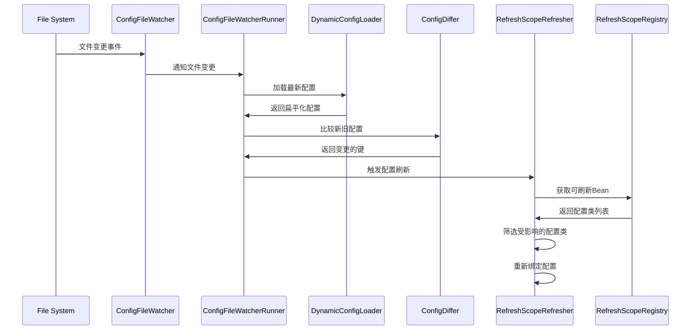

# Spring Boot 动态配置刷新功能说明文档

## 1. 需求分析

### 1.1 背景

在微服务架构中，配置管理是一个重要的环节。传统的配置管理方式需要重启应用才能生效，这在高可用性要求下是不可接受的。因此，需要实现配置的动态刷新功能，使得配置变更能够在不重启应用的情况下立即生效。

### 1.2 功能需求

- **配置文件监听**：监听 `application.yml`、`application-{env}.yml` 等配置文件的变更
- **配置热更新**：当配置文件发生变更时，自动刷新相关的配置类
- **日志配置刷新**：支持 Log4j2 XML 配置文件的动态刷新
- **精确刷新**：只刷新受影响的配置类，避免不必要的刷新
- **环境隔离**：不同环境（dev、prod等）只处理对应的配置文件

### 1.3 技术约束

- 基于 Spring Boot 框架
- 兼容 Spring Cloud 环境
- 支持 YAML 配置文件格式
- 支持 Log4j2 日志框架

## 2. 实现原理

### 2.1 整体架构

```
┌─────────────────┐    ┌─────────────────┐    ┌─────────────────┐
│   ConfigFile    │    │  ConfigFile     │    │  RefreshScope   │
│   Watcher       │───▶│  WatcherRunner  │───▶│  Refresher      │
└─────────────────┘    └─────────────────┘    └─────────────────┘
         │                       │                       │
         ▼                       ▼                       ▼
┌─────────────────┐    ┌─────────────────┐    ┌─────────────────┐
│  File System    │    │ DynamicConfig   │    │ RefreshScope    │
│  WatchService   │    │  Loader         │    │  Registry       │
└─────────────────┘    └─────────────────┘    └─────────────────┘
```

### 2.2 核心组件

#### 2.2.1 ConfigFileWatcher（文件监听器）

- **职责**：监听文件系统变化，检测配置文件变更
- **实现**：使用 Java NIO WatchService API
- **监听路径**：`config/` 目录下的配置文件（通过 `ConfigKit.getConfigPath()` 获取）
- **触发条件**：文件修改事件（ENTRY_MODIFY）
- **关键代码**：
  ```java
  String configDir = ConfigKit.getConfigPath();
  Path configPath = Paths.get(configDir);
  configPath.register(watchService, StandardWatchEventKinds.ENTRY_MODIFY);
  ```

#### 2.2.2 ConfigFileWatcherRunner（监听执行器）

- **职责**：协调文件监听和配置变更处理
- **功能**：
    - 管理监听文件列表
    - 启动监听线程
    - 处理配置变更回调
    - 维护当前配置状态

#### 2.2.3 DynamicConfigLoader（配置加载器）

- **职责**：加载和解析配置文件
- **支持格式**：YAML 配置文件
- **加载策略**：
    1. 加载主配置文件 `application.yml`（`ConfigKit.BOOT_CONFIG_FILE_NAME`）
    2. 加载当前激活 Profile 的配置文件（如 `application-prod.yml`，使用 `ConfigKit.BOOT_ENV_CONFIG_FILE_NAME` 模板）
    3. 合并配置并扁平化处理
- **关键代码**：

  ```java
  private static final String BASE_CONFIG = ConfigKit.BOOT_CONFIG_FILE_NAME;
  private static final String PROFILE_CONFIG_FORMAT = ConfigKit.BOOT_ENV_CONFIG_FILE_NAME;
  ```

#### 2.2.4 RefreshScopeRegistry（刷新范围注册表）

- **职责**：管理可刷新的配置类
- **扫描条件**：同时带有 `@RefreshScope` 和 `@ConfigurationProperties` 注解的 Bean
- **存储结构**：按配置前缀分组存储
- **关键代码**：
  ```java
  Map<String, Object> candidates = context.getBeansWithAnnotation(RefreshScope.class);
  for (Map.Entry<String, Object> entry : candidates.entrySet()) {
      ConfigurationProperties cpAnno = bean.getClass().getAnnotation(ConfigurationProperties.class);
      if (cpAnno != null) {
          String prefix = normalizePrefix(cpAnno.prefix());
          prefixBindableMap.put(prefix, new BindableTarget(bean, prefix));
      }
  }
  ```

#### 2.2.5 RefreshScopeRefresher（刷新执行器）

- **职责**：执行配置刷新逻辑
- **刷新策略**：
    1. 根据变更的配置键判断受影响的配置类
    2. 使用 Spring Boot Binder 重新绑定配置
    3. 更新 Environment 中的配置源
- **关键代码**：
  ```java
  // 前缀匹配判断
  boolean affected = changedKeys.stream().anyMatch(k -> k.startsWith(prefix));
  
  // 重新绑定配置
  Binder.get(environment).bind(
      prefix.substring(0, prefix.length() - 1),
      Bindable.ofInstance(bean)
  );
  ```

#### 2.2.6 ConfigDiffer（配置比较器）

- **职责**：比较新旧配置，识别变更项
- **比较逻辑**：逐项比较配置值，记录变更的键
- **关键代码**：
  ```java
  public static DiffResult diff(Map<String, Object> oldConfig, Map<String, Object> newConfig) {
      Set<String> changedKeys = new HashSet<>();
      for (String key : allKeys) {
          Object oldValue = oldConfig.get(key);
          Object newValue = newConfig.get(key);
          if (!Objects.equals(oldValue, newValue)) {
              changedKeys.add(key);
          }
      }
      return new DiffResult(changedKeys);
  }
  ```

### 2.3 配置刷新流程



## 3. 使用指南

### 3.1 基本配置

#### 3.1.1 启用配置刷新功能

```yaml
# application.yml
zeka-stack:
  app:
    refresh: true  # 默认开启，可显式配置 false 关闭
```

#### 3.1.2 启动脚本示例

```bash
#!/bin/bash
# 生产环境启动脚本
nohup ${JAVA_HOME}/bin/java -jar \
  ${JVM_OPTS} \
  -Ddeploy.path=${DEPLOY_DIR} \
  -Dstart.type=shell \
  ${DEBUG_OPTS} \
  ${JAR_FILE} \
  --spring.profiles.active=${ENV} \
  --spring.config.location=${DEPLOY_DIR}/config/ &
```

**关键参数说明**：

- `-Ddeploy.path=${DEPLOY_DIR}`：指定部署目录
- `-Dstart.type=shell`：标识为脚本启动模式
- `--spring.config.location=${DEPLOY_DIR}/config/`：指定配置文件位置

#### 3.1.3 配置类示例

```java
@RefreshScope
@ConfigurationProperties(prefix = "my-app")
public class MyAppProperties {
    private String name;
    private int port;
    private Map<String, Object> custom;
    
    // getters and setters
}
```

### 3.2 配置文件结构

#### 3.2.1 主配置文件

```yaml
# application.yml
server:
  port: 8080

my-app:
  name: "my-application"
  port: 9090
  custom:
    feature1: true
    feature2: false
```

#### 3.2.2 环境配置文件

```yaml
# application-prod.yml
server:
  port: 80

my-app:
  name: "my-application-prod"
  custom:
    feature1: false
    feature2: true
```

### 3.3 日志配置刷新

#### 3.3.1 日志配置属性

```yaml
# application.yml
zeka-stack:
  logging:
    config: log4j2-file.xml  # 指定日志配置文件
    refresh: true             # 启用日志配置刷新
    appName: "my-application" # 应用名称，用于日志文件路径
    enableShowLocation: true  # 是否显示日志位置（仅控制台有效）
```

#### 3.3.2 日志配置文件

```xml
<!-- log4j2-file.xml -->
<Configuration>
    <Appenders>
        <File name="FileAppender" fileName="logs/app.log">
            <PatternLayout pattern="%d{yyyy-MM-dd HH:mm:ss} [%t] %-5level %logger{36} - %msg%n"/>
        </File>
    </Appenders>
    <Loggers>
        <Root level="info">
            <AppenderRef ref="FileAppender"/>
        </Root>
    </Loggers>
</Configuration>
```

#### 3.3.3 日志配置刷新机制

- **Spring Boot 环境**：通过 `RefreshLogLevelAutoConfiguration` 实现
- **Spring Cloud 环境**：通过 `EnvironmentChangeEvent` 实现
- **配置文件监听**：监听指定的 Log4j2 XML 配置文件
- **自动重载**：配置文件变更时自动调用 `Configurator.initialize()` 重新加载

### 3.4 自定义配置监听

#### 3.4.1 自定义文件监听

```java
@Component
public class CustomConfigFileWatcherCustomizer implements ConfigFileWatcherCustomizer {
    @Override
    public void customize(ConfigFileWatcherRunner runner) {
        runner.registerWatchedFile("custom-config.yml");
    }
}
```

#### 3.4.2 自定义配置变更处理

```java
@Component
@Order(100)
public class CustomConfigChangedHandler implements ConfigChangedHandler {
    @Override
    public void onChanged(String changedFile, Set<String> changedKeys, Map<String, Object> latest) {
        if (changedFile.equals("custom-config.yml")) {
            // 自定义处理逻辑
            log.info("自定义配置文件发生变更: {}", changedKeys);
        }
    }
}
```

## 4. 实现细节

### 4.1 自动配置机制

#### 4.1.1 条件注解

```java
@ConditionalOnClass(name = "org.springframework.cloud.context.config.annotation.RefreshScope")
@ConditionalOnMissingClass("org.springframework.cloud.context.scope.refresh.ContextRefresher")
@ConditionalOnProperty(name = "zeka-stack.app.refresh", havingValue = "true", matchIfMissing = true)
```

#### 4.1.2 Bean 注册顺序

1. `RefreshScopeRegistry` - 注册可刷新配置类
2. `DynamicConfigLoader` - 配置加载器
3. `RefreshScopeRefresher` - 配置刷新器
4. `ConfigFileWatcherRunner` - 文件监听执行器
5. `ConfigFileWatcherCustomizer` - 自定义监听器

### 4.2 配置加载策略

#### 4.2.1 配置文件优先级

1. `application.yml` - 基础配置
2. `application-{profile}.yml` - 环境特定配置（覆盖基础配置）

#### 4.2.2 配置文件路径

- **本地开发环境**：`src/main/resources/` 目录
- **生产环境**：`config/` 目录（通过 `-Ddeploy.path` 参数指定）
- **路径获取逻辑**：
  ```java
  public static String getConfigPath() {
      String startType = System.getProperty(App.START_TYPE);
      if (StringUtils.isNotBlank(startType) && 
          (App.START_SHELL.equals(startType) || App.START_DOCKER.equals(startType))) {
          // 生产环境：从系统属性获取配置路径
          configPath = System.getProperty(App.APP_CONFIG_PATH);
      } else {
          // 本地开发：使用 classpath
          configPath = StartUtils.getClasspath();
      }
      return configPath;
  }
  ```

#### 4.2.3 配置扁平化

```java
// 原始配置
{
  "server": {
    "port": 8080
  },
  "my-app": {
    "name": "app"
  }
}

// 扁平化后
{
  "server.port": 8080,
  "my-app.name": "app"
}
```

### 4.3 精确刷新机制

#### 4.3.1 前缀匹配

```java
// 配置类前缀
@ConfigurationProperties(prefix = "my-app")
// 变更的配置键
"my-app.name", "my-app.port"

// 前缀匹配判断
boolean affected = changedKeys.stream()
    .anyMatch(k -> k.startsWith("my-app."));
```

#### 4.3.2 配置重新绑定

```java
// 使用 Spring Boot Binder 重新绑定
Binder.get(environment).bind(
    prefix.substring(0, prefix.length() - 1),
    Bindable.ofInstance(bean)
);
```

## 5. 未完成的工作

### 5.1 Log4j2 XML 配置监听问题

#### 5.1.1 当前问题

- Log4j2 XML 配置文件通常打包在 JAR 包中
- JAR 包内的文件无法通过文件系统监听器检测变更
- 需要将配置文件提取到外部目录才能实现监听

#### 5.1.2 解决方案

1. **配置文件外部化**：
    - 将 `log4j2.xml` 从 JAR 包中提取到 `config/` 目录
    - 修改 Log4j2 配置，使其从外部目录加载配置文件

2. **配置加载策略**：
   ```java
   // 优先从外部目录加载
   String externalConfig = ConfigKit.getConfigPath() + "/log4j2.xml";
   if (new File(externalConfig).exists()) {
       return externalConfig;
   }
   // 回退到 classpath 中的默认配置
   return "classpath:log4j2-default.xml";
   ```

3. **启动时配置复制**：
   ```java
   // 应用启动时，如果外部配置文件不存在，从 classpath 复制
   if (!externalConfigFile.exists()) {
       copyFromClasspath("log4j2-default.xml", externalConfigFile);
   }
   ```

### 5.2 实现计划

#### 5.2.1 第一阶段：配置文件外部化

- [ ] 实现 Log4j2 配置文件的外部化加载
- [ ] 添加启动时配置文件复制机制
- [ ] 修改 Log4j2 配置加载逻辑
- [ ] 实现配置文件优先级：外部目录 > classpath

#### 5.2.2 第二阶段：监听机制完善

- [ ] 完善 Log4j2 XML 文件监听
- [ ] 添加配置文件变更时的自动重载
- [ ] 实现日志级别动态调整
- [ ] 添加日志配置变更验证

#### 5.2.3 第三阶段：功能增强

- [ ] 添加配置文件变更通知机制
- [ ] 实现配置变更历史记录
- [ ] 添加配置变更回滚功能
- [ ] 实现配置变更的灰度发布

### 5.3 具体实现建议

#### 5.3.1 Log4j2 配置文件外部化

```java
@Component
public class Log4j2ConfigExternalizer {
    
    @PostConstruct
    public void externalizeConfig() {
        String externalConfigPath = ConfigKit.getConfigPath() + "log4j2.xml";
        File externalConfigFile = new File(externalConfigPath);
        
        if (!externalConfigFile.exists()) {
            // 从 classpath 复制默认配置到外部目录
            copyFromClasspath("log4j2-default.xml", externalConfigFile);
        }
    }
    
    private void copyFromClasspath(String classpathResource, File targetFile) {
        try (InputStream input = getClass().getClassLoader().getResourceAsStream(classpathResource);
             FileOutputStream output = new FileOutputStream(targetFile)) {
            IOUtils.copy(input, output);
        }
    }
}
```

#### 5.3.2 配置文件加载策略

```java
public class Log4j2ConfigLoader {
    
    public String getConfigLocation() {
        // 优先从外部目录加载
        String externalConfig = ConfigKit.getConfigPath() + "log4j2.xml";
        if (new File(externalConfig).exists()) {
            return externalConfig;
        }
        
        // 回退到 classpath 中的默认配置
        return "classpath:log4j2-default.xml";
    }
}
```

## 6. 优化建议

### 6.1 性能优化

#### 6.1.1 配置缓存

```java
// 添加配置缓存机制
@Cacheable(value = "configCache", key = "#configName")
public Map<String, Object> loadConfig(String configName) {
    // 配置加载逻辑
}
```

#### 6.1.2 批量刷新

```java
// 支持批量配置刷新，减少刷新次数
public void refreshBatch(Set<String> changedKeys) {
    // 按配置类分组，批量刷新
    Map<String, Set<String>> groupedKeys = groupByPrefix(changedKeys);
    for (Map.Entry<String, Set<String>> entry : groupedKeys.entrySet()) {
        refreshByPrefix(entry.getKey(), entry.getValue());
    }
}
```

### 6.2 可靠性增强

#### 6.2.1 错误处理

```java
// 添加重试机制
@Retryable(value = {IOException.class}, maxAttempts = 3)
public Map<String, Object> loadConfig(String configName) {
    // 配置加载逻辑
}
```

#### 6.2.2 配置验证

```java
// 添加配置变更前的验证
public boolean validateConfig(Map<String, Object> config) {
    // 配置格式验证
    // 必填项检查
    // 值范围验证
}
```

### 6.3 监控和日志

#### 6.3.1 监控指标

```java
// 添加配置刷新监控指标
@Component
public class ConfigRefreshMetrics {
    private final Counter refreshCounter;
    private final Timer refreshTimer;
    private final Gauge refreshSuccessRate;
    
    public void recordRefresh(String configName, long duration) {
        refreshCounter.increment();
        refreshTimer.record(duration, TimeUnit.MILLISECONDS);
    }
    
    public void recordRefreshSuccess(boolean success) {
        if (success) {
            refreshSuccessRate.increment();
        }
    }
}
```

#### 6.3.2 详细日志

```java
// 添加详细的配置变更日志
log.info("配置刷新开始 - 文件: {}, 变更键: {}", changedFile, changedKeys);
log.debug("配置变更详情 - 旧值: {}, 新值: {}", oldValue, newValue);
log.info("配置刷新完成 - 受影响的Bean: {}", affectedBeans);

// 添加配置刷新性能日志
log.info("配置刷新耗时: {}ms, 文件: {}", duration, changedFile);

// 添加配置刷新错误日志
log.error("配置刷新失败 - 文件: {}, 错误: {}", changedFile, error.getMessage());
```

#### 6.3.3 健康检查

```java
@Component
public class ConfigRefreshHealthIndicator implements HealthIndicator {
    
    @Override
    public Health health() {
        // 检查配置文件监听器状态
        // 检查最近配置刷新是否成功
        // 检查配置文件是否存在
        return Health.up()
            .withDetail("watcherStatus", "running")
            .withDetail("lastRefreshTime", lastRefreshTime)
            .withDetail("configFiles", watchedFiles)
            .build();
    }
}
```

## 7. TODO List

### 7.1 高优先级

- [ ] 实现 Log4j2 XML 配置文件外部化
- [ ] 完善 Log4j2 配置文件监听机制
- [ ] 添加配置变更验证逻辑
- [ ] 实现配置刷新失败重试机制
- [ ] 添加配置变更通知机制

### 7.2 中优先级

- [ ] 实现配置缓存机制
- [ ] 添加批量配置刷新功能
- [ ] 实现配置变更历史记录
- [ ] 添加配置变更回滚功能
- [ ] 完善监控和指标收集

### 7.3 低优先级

- [ ] 支持更多配置文件格式（properties、json等）
- [ ] 实现配置热备份功能
- [ ] 添加配置变更审计日志
- [ ] 实现配置变更的灰度发布
- [ ] 支持配置变更的审批流程

## 8. 总结

本动态配置刷新功能基于 Spring Boot 框架实现，通过文件系统监听、配置加载、差异比较和精确刷新等机制，实现了配置的热更新功能。该功能具有以下特点：

### 8.1 核心优势

1. **自动化**：无需手动干预，配置变更自动生效
2. **精确性**：只刷新受影响的配置类，避免不必要的刷新
3. **可靠性**：具备错误处理和重试机制
4. **扩展性**：支持自定义监听器和处理器
5. **兼容性**：兼容 Spring Cloud 环境

### 8.2 技术亮点

1. **智能监听**：基于 Java NIO WatchService 实现高效的文件系统监听
2. **精确刷新**：通过前缀匹配和 Spring Boot Binder 实现精确的配置刷新
3. **环境适配**：自动适配本地开发和生产环境的配置文件路径
4. **组件化设计**：模块化的组件设计，便于扩展和维护

### 8.3 应用价值

1. **提升运维效率**：配置变更无需重启应用，减少服务中断时间
2. **增强系统稳定性**：避免因配置变更导致的服务重启风险
3. **降低运维成本**：减少人工干预，自动化配置管理
4. **支持快速迭代**：支持配置的快速调整和验证

### 8.4 未来展望

1. **完善 Log4j2 配置监听**：解决 JAR 包内配置文件监听问题
2. **增强监控能力**：添加更完善的监控指标和告警机制
3. **支持更多格式**：扩展支持 properties、json 等配置文件格式
4. **配置管理平台**：集成配置管理平台，提供可视化的配置管理界面

通过合理的架构设计和实现，该功能能够有效提升微服务架构中配置管理的效率和可靠性，为企业的数字化转型提供强有力的技术支撑。 